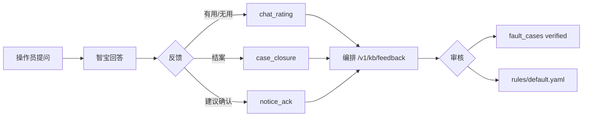

# 知识库使用反馈 — 流程与对接约定

本文档说明 **C2+** 反馈闭环：操作人员如何通过问答、运维建议确认把现场经验沉淀为 `fault_cases` 与 A2 规则。

| 产物 | 路径 |
|------|------|
| 反馈 JSON Schema | [`CornerstoneAgent/schemas/kb-feedback.v1.json`](../../../CornerstoneAgent/schemas/kb-feedback.v1.json) |
| 案例 JSON Schema | [`fault-case.v1.json`](fault-case.v1.json) |
| 编排 HTTP 草案 | [`CornerstoneAgent/INTERFACE.md` §9](../../../CornerstoneAgent/INTERFACE.md) |
| 总体规划 | [`PLAN.md` §C2+](../../../PLAN.md) |

## 闭环总览



## 三类入口

### 1. 智宝对话（`channel=zhibao`）

| 动作 | `kind` | 必填字段 |
|------|--------|----------|
| 回答后点「有用 / 需改进」 | `chat_rating` | `rating.useful`；建议带 `user_note` |
| 排故结束填写结果 | `case_closure` | `outcome`；建议 `root_cause`、`actions_taken` |
| 指出 AI 错误 | `correction` | `outcome=wrong`；`user_note` 说明实际原因 |
| 要求转人工 | `escalation` | `user_note` |

编排从会话上下文自动填充：`source.chat_task_id`、`source.instance_code`、`source.trace_id`、`context.snapshot_id`、`context.case_ids_cited`。

### 2. Bridge 运维建议 ack（`channel=bridge_ui`）

路径：`post_operator_notice` → Bridge 对话框 → 操作员 ack → Agent sync → **编排生成 `notice_ack`**。

| Bridge 字段 | 映射到反馈 |
|-------------|------------|
| `noticeId` | `source.notice_id` |
| `traceId` | `source.trace_id` |
| `ackNote` | `user_note` |
| `instrumentId` / `labId` | `context` |
| `evidence[].ruleId` | `context.rule_ids` |

若 `ack_note` 含处置摘要，可同时写入 `actions_taken`；复杂案例带 `proposed_case` 进入审核队列。

### 3. 人工导入（`channel=manual_import`）

专家从日历/周报提炼案例时，可直接提交 `case_closure` + 完整 `proposed_case`，或跳过反馈直接写 `raw/fault_cases/examples/*.json`。

## 审核与晋升（`promote`）

1. 编排 `GET /v1/kb/feedback?queue=review` 列出待审条目。
2. 专家 `POST /v1/kb/feedback/{id}/promote`：
   - 写入 `raw/fault_cases/<case_id>.json`，`status=verified`
   - 回写 `metadata.feedback_ids`
   - 可选：触发 Markdown 摘要生成、向量索引重建
3. `outcome=wrong` 的反馈：修订规则或标记案例 `deprecated`，**不删除**原始反馈。

## 参数预警关联

| 预警层 | 触发 | 反馈作用 |
|--------|------|----------|
| A2 硬规则 | `rules_eval` → `post_operator_notice` | `notice_ack` 验证；多次 `wrong` 则改阈值 |
| A1 统计基线 | 时序偏离 band | `case_closure.params_before_after` 校准基线 |
| 案例相似 | 检索 `fault_cases` | `useful_refs` 调整权重 |

## 示例：结案反馈 JSON

```json
{
  "schema_version": "kb-feedback.v1",
  "feedback_id": "fb-20260830-001",
  "kind": "case_closure",
  "source": {
    "channel": "zhibao",
    "chat_task_id": "f6a2bb71-…",
    "instance_code": "qwenpaw-mfg-025",
    "agent_id": "CornerstoneMock",
    "trace_id": "trc-20260830-abc",
    "user_id": "080916"
  },
  "context": {
    "lab_id": "lab-2lg",
    "instrument_id": "GC8",
    "model": "CS844",
    "snapshot_id": "snap-20260830-xyz",
    "case_ids_cited": ["fc-gc8-sulfur-tail-oxygun-001"]
  },
  "rating": { "useful": true, "score": 5 },
  "outcome": "resolved",
  "ai_summary": "建议先查氧枪流量并冲洗限流器",
  "user_note": "流量 0.3，冲洗后 0.85，标样正常",
  "root_cause": "下氧枪限流器堵塞",
  "actions_taken": ["冲洗下氧枪限流器"],
  "params_before_after": [
    { "name": "氧枪流量", "before": "0.3", "after": "0.85", "unit": "L/min" }
  ],
  "useful_refs": [
    { "kind": "fault_case", "ref": "fc-gc8-sulfur-tail-oxygun-001", "helpful": true }
  ],
  "created_at": "2026-08-30T18:00:00+08:00"
}
```

## 「老法师」能力等级（检索 + 反馈驱动）

| 等级 | 条件 | 表现 |
|------|------|------|
| L1 检索员 | C2 手册 + 日历 | 引用章节与相似历史 |
| L2 诊断员 | L1 + A1/A2 实时数据 | 带参数值的检查清单 |
| L3 参谋 | L2 + verified `fault_cases` + 反馈权重 | 按历史成功率排序建议 |
| L4 老法师 | L3 + 调参/方法统计 | 指导方法开发与参数窗口 |

反馈数据是 L2→L4 的关键燃料：`wrong` 与 `resolved` 同等重要。
