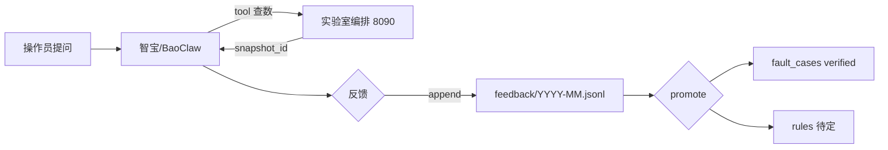

# 知识库使用反馈 — 流程与对接约定（Plan A）

反馈主存储在 **BaoClaw 工作区** `knowledge/feedback/*.jsonl`（公司侧），**不**依赖实验室编排数据库。案例晋升写入 `raw/fault_cases/`。

| 产物 | 路径 |
|------|------|
| 反馈 JSONL | [`feedback/`](../feedback/README.md) |
| CLI | [`feedback_tool.py`](../feedback_tool.py) |
| 反馈 JSON Schema | [`CornerstoneAgent/schemas/kb-feedback.v1.json`](../../../CornerstoneAgent/schemas/kb-feedback.v1.json) |
| 案例 JSON Schema | [`fault-case.v1.json`](fault-case.v1.json) |
| 编排边界（仅证据回传） | [`CornerstoneAgent/INTERFACE.md` §9](../../../CornerstoneAgent/INTERFACE.md) |

## 数据归属

| 数据 | 存放位置 | 说明 |
|------|----------|------|
| 使用反馈 | `BaoClaw/knowledge/feedback/YYYY-MM.jsonl` | Git 同步，公司侧维护 |
| 晋升日志 | `feedback/promote_log.jsonl` | feedback_id → case_id |
| 故障案例 | `raw/fault_cases/*.json` | promote 产出 |
| 时序 / 快照 | 实验室 Agent | 仅 `snapshot_id` 写入反馈 context |
| Bridge ack 审计 | 实验室 Agent `operator_notices.jsonl` | 整理为 `notice_ack` 后 append 到公司侧 |

## 闭环总览



## 三类入口

### 1. 智宝对话（`channel=zhibao`）

| 动作 | `kind` | 必填字段 |
|------|--------|----------|
| 回答后点「有用 / 需改进」 | `chat_rating` | `rating.useful` |
| 排故结束 | `case_closure` | `outcome`；建议 `root_cause`、`actions_taken` |
| 纠正 AI | `correction` | `outcome=wrong` |
| 转人工 | `escalation` | `user_note` |

写入方式：整理 JSON → `py -3 feedback_tool.py append --file payload.json`（后续可接智宝插件自动调用）。

`context` 中填写：`chat_task_id`、`trace_id`、`snapshot_id`（来自实验室 tool 回传，**不**把快照文件拷到公司侧）。

#### 过渡方案：`/chat-modern` 的 `follow_ups` 芯片（2026-09）

Agent 控制台 iframe **不支持**；仅智宝 **兼容 AI 对话页** `/chat-modern` 会把助手回复末尾的

`{"follow_ups":["有用","需改进",...]}`（最多 5 条）渲成可点芯片。点击后文案作为新用户消息发回。

规范见工作区 `AGENTS.md`「智宝 modern 页反馈芯片」。点选后的入库仍走上表 `chat_rating` / `case_closure`（有 `feedback_tool.py` 时）；无写权限则只做对话确认。

### 2. Bridge 运维建议 ack（`channel=bridge_ui`）

机房路径：`post_operator_notice` → Bridge ack → Agent `operator_notices.jsonl`。

**Plan A**：维护员从审计导出或脚本转换为 `notice_ack` JSON，在公司侧执行 `append`（无需登录机房查库）。

| Bridge 字段 | 映射 |
|-------------|------|
| `noticeId` | `source.notice_id` |
| `traceId` | `source.trace_id` |
| `ackNote` | `user_note` / `actions_taken` |

### 3. 人工导入（`channel=manual_import`）

专家可直接 `append`，或跳过反馈写 `raw/fault_cases/examples/*.json`。

## 审核与晋升（`feedback_tool.py promote`）

```bash
cd BaoClaw/knowledge
py -3 feedback_tool.py list --queue
py -3 feedback_tool.py promote --feedback-id fb-xxx --by 审核人
```

1. 从 JSONL 找到 `proposed_case` 或配合 `--case-file`。
2. 写入 `raw/fault_cases/<case_id>.json`，`status=verified`。
3. 追加 `promote_log.jsonl`；案例 `metadata.feedback_ids` 回链。

`outcome=wrong` 的反馈保留在 JSONL，用于降权错误引用，不自动删除。

## 参数预警关联

| 预警层 | 触发 | 反馈作用 |
|--------|------|----------|
| A2 硬规则 | `rules_eval` → `post_operator_notice` | `notice_ack` 验证规则 |
| A1 统计基线 | 时序偏离 | `params_before_after` 写入结案反馈 |
| 案例相似 | `fault_cases` 检索 | `useful_refs` 调权 |

## 示例：结案反馈

见 [`feedback/_example_payload.json`](../feedback/_example_payload.json) 与 `feedback/2026-08.jsonl`（运行 append 后生成）。

## 「老法师」能力等级

| 等级 | 条件 | 表现 |
|------|------|------|
| L1 检索员 | 手册 + 日历 | 引用章节与历史 |
| L2 诊断员 | L1 + 实验室实时 tool | 带参数检查清单 |
| L3 参谋 | L2 + verified fault_cases + 反馈 JSONL | 按成功案例排序 |
| L4 老法师 | L3 + sets 统计 | 调参与方法开发 |

反馈 JSONL 是 L2→L4 的燃料；`wrong` 与 `resolved` 同等重要。
