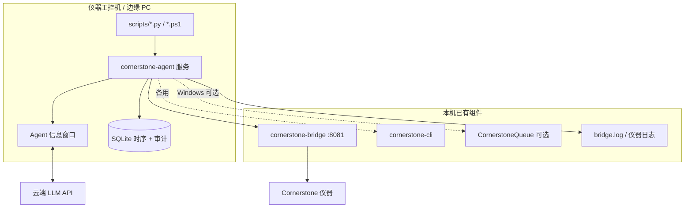

# CornerstoneAgent — 仪器驻场智能助手

本文档定义 **CornerstoneAgent** 的产品定位、架构与实施阶段，与根目录 [PLAN.md](../PLAN.md) §3 对齐。Agent 是部署在**仪器工控机或实验室边缘 PC** 上的常驻进程，负责**采集仪器参数**、**规则研判**、**与云端大语言模型协作**，并通过**本地信息窗口**向实验员展示可操作的指导（正确使用、快速维护、排故）。

---

## 1. 核心定位

| 维度 | 说明 |
|------|------|
| **是什么** | 仪器侧的「数据采集 + 规则顾问 + 云端 LLM 窗口」边缘服务，不替代 Bridge 网关，不直接改写仪器参数（除非未来显式白名单）。 |
| **不是什么** | 不是第二个 Web 分析页；不是 Modbus/MQTT 北向（属 Bridge P2+）；不是 Queue 的样品发送 UI（Queue 仍负责人工 AddSamples）。 |
| **与云端 LLM 的分工** | **Agent 负责事实**：按调度或按需拉取结构化仪器数据、本地日志片段、可选 UI 控件树摘要；**云端 LLM 负责推理与话术**：维护步骤、排故路径、操作提醒；结论经 Agent **信息窗口** 呈现，并全量留痕。 |
| **默认原则** | **规则优先、LLM 为辅**；规则命中可直接告警/建议，无需等待模型；LLM 输入仅结构化字段与脱敏统计，可配置关闭云端调用。 |

---

## 2. 用户场景

### 2.1 长周期参数记录

- 按配置间隔（如 1 min / 5 min / 1 h）通过 **Bridge REST** 拉取：
  - `GET /api/status`、`GET /api/instrument/system-parameters`
  - `GET /api/instrument/counters`、诊断类 `status-check` / 漏气 / 系统检查等价接口
- 写入本地 **时序存储**（SQLite + 可选按日滚动 JSON/CSV 导出），支持：
  - 参数漂移对比（与昨日/上周同刻）
  - 维护周期提醒（计数器、运行小时、耗材阈值）
  - 离线续传队列（网络恢复后批量上报摘要，非原始谱图）

### 2.2 短期采集（会话/批次）

- 分析批次或排故会话期间**加密采样**（如每 10–30 s 或事件触发）：
  - `set-stats`、`set-reps`、关键 `Status` 字段
  - Bridge `bridge.log` 尾部、仪器 `log-data` 摘要（条数上限）
- 会话结束生成 **采集包**（`sessionId` + 时间范围 + 结构化 JSON），供规则引擎与单次 LLM 问答使用。

### 2.3 规则建议（无 AI）

对分析数据与仪器状态做可配置规则，输出结构化建议，例如：

| 规则域 | 示例条件 | 建议级别 |
|--------|----------|----------|
| 精密度 | RSD% 超阈值、n 不足 | review / reject |
| QC | 空白偏高、标准漂移 | 复核、重新校准提示 |
| 仪器状态 | 漏气失败、系统检查未通过、业务离线 | 维护 / 停机等 |
| 队列 | 发送失败 streak、队列积压 | 检查 Bridge/账号/网络 |

每条建议带 `ruleId`、`severity`、`timestamp`、`evidence`（引用字段路径），便于审计与 LLM 上下文拼接。

### 2.4 云端 LLM 协作

```
实验员 / 运维
      │
      ▼
┌─────────────────┐     结构化上下文      ┌──────────────────┐
│ Agent 信息窗口   │ ◄────────────────── │ 云端大语言模型 API │
│ (建议/对话/步骤) │ ──用户问题+会话ID──► │ (OpenAI 兼容等)    │
└────────┬────────┘                       └──────────────────┘
         │
         │ 编排采集
         ▼
┌────────────────────────────────────────────────────────────┐
│ Agent 核心                                                  │
│  · 采集调度（长/短周期）  · 规则引擎  · 会话与脱敏策略        │
└────────┬───────────────────────────────────────────────────┘
         │
    ┌────┴────┬──────────────┬─────────────────┐
    ▼         ▼              ▼                 ▼
 Bridge    CLI 脚本      本地日志 tail      窗口检查(可选)
 REST      cornerstone-cli  bridge.log     FlaUI / Queue 复用
```

- **LLM 不直连仪器**：所有仪器访问经 Agent → Bridge（或紧急时 `cornerstone-cli` 库），保证 Cookie/会话与解析一致。
- **Agent 提供「与大语言模型输出的信息窗口」**：桌面小窗或托盘展开面板，展示：
  - 当前规则告警与 LLM 回复（分栏或时间线）
  - 引用的证据（哪次采集、哪条规则、哪段日志）
  - 用户可追问；追问时 Agent 自动附带**最新短期采集包**与相关长周期趋势摘要。

### 2.5 正确使用、维护与排故

- **正确使用**：结合 `system-parameters`、方法/状态字段，LLM 生成操作检查清单（Agent 仅展示，不自动点击仪器按钮，除非未来与 Queue 一样显式开启白名单自动化）。
- **快速维护**：规则触发维护项 + LLM 步骤说明（换件、校准、清零计数器等），链接到 Bridge/CLI 可执行的**只读诊断命令**说明（复制即用）。
- **排故**：短期采集 + `log-data` 摘要 + 可选 **UI Inspect**（自 CornerstoneQueue 的 FlaUI 模式抽象为可选 Windows 模块），将「对话框标题/错误 AutomationId/最近状态变化」送入 LLM，减少盲目重启。

---

## 3. 技术架构

### 3.1 依赖边界



| 组件 | 职责 |
|------|------|
| `cornerstone-agent` | 主进程：调度、存储、规则、LLM 客户端、窗口 UI |
| `cornerstone-bridge` | 唯一推荐的仪器数据面（REST + 已解析 JSON） |
| `cornerstone-cli` | 脚本与离线排故：40+ `tcp` 子命令；Agent 以**库或子进程**调用，不重复实现协议 |
| `CornerstoneQueue` | 不合并进 Agent；**可选**共享 FlaUI Inspect 逻辑或 HTTP 触发 inspect 结果回传 |
| 云端 LLM | HTTPS；API Key 存本地配置或 OS 凭据库；支持代理与超时重试 |

### 3.2 采集实现路径

| 路径 | 用途 | 说明 |
|------|------|------|
| **Bridge REST** | 默认 | `/api/status`、`/api/instrument/*`、`/api/diagnostic/*` |
| **CLI 脚本** | 批量/排故/CI | `CornerstoneAgent/scripts/` 包装 `cornerstone-cli tcp …`，由 Agent 调度或 cron 调用 |
| **本地日志** | 排故上下文 | 尾随 `bridge.log`（尊重 Bridge 的 RQ 过滤策略）；可配置 inclusion |
| **窗口检查** | UI 态排故 | Windows：UIA3 控件树摘要（深度/节点上限同 Queue）；输出 JSON 供规则/LLM |

### 3.3 配置要点（规划）

示例文件：`cornerstone-agent.config.toml`（待实现）

| 配置块 | 键（示例） | 含义 |
|--------|------------|------|
| `bridge` | `base_url` | 默认 `http://127.0.0.1:8081` |
| `acquisition.long` | `interval_s`, `endpoints[]` | 长周期拉取列表 |
| `acquisition.short` | `interval_s`, `duration_s`, `triggers[]` | 短期会话采集 |
| `storage` | `db_path`, `retention_days` | SQLite 与保留策略 |
| `rules` | `file` / 内嵌 YAML | 规则定义路径 |
| `llm` | `enabled`, `base_url`, `model`, `api_key_env` | 云端模型；`enabled=false` 时仅规则+窗口本地提示 |
| `window` | `mode=tray\|panel`, `always_on_top` | 信息窗口行为 |
| `privacy` | `redact_sample_names`, `max_log_lines` | 脱敏与上传边界 |

### 3.4 审计与追溯

所有输出（规则建议、LLM 回复、采集包引用）写入：

- `agent_audit` 表：`(id, ts, type, rule_id?, model?, prompt_hash?, response_summary, session_id)`
- 关联 `acquisition_snapshot_id`，满足合规「可解释、可回放结构化证据」。

---

## 4. CLI 与脚本约定（规划）

主入口：`cornerstone-agent`（与 `cornerstone-cli` 并列安装）

| 子命令 | 作用 |
|--------|------|
| `run` | 启动常驻服务 + 信息窗口 |
| `collect once` | 单次拉取并打印/存储 JSON |
| `collect session --duration 30m` | 短期采集会话 |
| `rules eval` | 对当前数据跑规则，输出建议 JSON |
| `ask "…"` | 带上下文调用云端 LLM（CLI 排故，无 GUI） |
| `log tail -n 200` | 本地日志片段（供脚本管道） |
| `ui inspect` | Windows：输出控件树摘要 JSON |

`scripts/` 目录提供可编排示例：`record-parameters.ps1`、`troubleshoot-status.ps1`、`export-session-for-llm.py`。

---

## 5. 信息窗口（LLM 输出面）

| 区域 | 内容 |
|------|------|
| **状态条** | Bridge 在线、最近采集时间、LLM 连接/规则-only 模式 |
| **告警区** | 规则引擎实时建议（可确认/静默） |
| **对话区** | 用户问题与云端 LLM 回复；支持「插入当前仪器快照」快捷操作 |
| **证据区** | 展开本次回复引用的参数表、统计、日志行、Inspect 摘要 |

技术选型（建议）：与 Bridge UI 一致用 **PySide6** 小窗 + 系统托盘；或与 Queue 并列仅 Windows。首版优先 **PySide6**，便于与 `cornerstone-bridge-ui` 共用打包经验。

---

## 6. 实施阶段

| 阶段 | 内容 | 验收 |
|------|------|------|
| **A0** | 包骨架、`BridgeApiClient`、示例配置、无 UI | `collect once` 能落盘 JSON |
| **A1** | 长/短周期调度 + SQLite 时序 | 可查询 24h 内参数曲线导出 |
| **A2** | 规则引擎 v1 + 本地建议 JSON | RSD/状态/队列类规则可配置 |
| **A3** | 云端 LLM 客户端 + 脱敏策略 | `ask` 与信息窗口可对话，可关闭 LLM |
| **A4** | CLI 脚本、日志 tail、Windows UI inspect | 排故会话端到端：采集→规则→LLM→窗口 |
| **A5** | 运维：心跳、配置热加载、离线队列、安装包组件 | 7×24 驻场；installer 可选 Agent |

与 [PLAN.md](../PLAN.md) 里程碑关系：**A1–A2** 对应原「规则监控/审核」；**A3–A4** 将 AI 明确为**云端 LLM + Agent 采集闭环**，信息窗口为新增交付物。

---

## 7. 与现有组件协同

| 组件 | 协同方式 |
|------|----------|
| **Bridge** | Agent 唯一主数据通道；北向 MQTT 可转发 Agent 告警摘要（Bridge P2+） |
| **Web** | Web 继续做人机分析图表；Agent 不重复 ECharts，可提供 deep link 到 Web 分析页 |
| **Queue** | 人工发样不变；发送成功事件可选触发 Agent「短期采集开始」 |
| **Bridge UI** | 运维看网关日志；Agent 看仪器建议，职责分离 |

---

## 8. 安全与合规

- API Key 不得写入仓库；使用环境变量或 Windows 凭据。
- 默认不上传样品名/客户标识；谱图仅统计摘要（均值、RSD、峰面积区间等）。
- LLM 请求超时、失败时回退为**仅规则建议**。
- 禁止 LLM 输出直接映射为仪器写操作（无自动 `AddSamples`/RC 写）。

---

## 9. 待细化产物

- `schemas/suggestion.json` — 规则/LLM 统一建议结构
- `schemas/acquisition-snapshot.json` — 短期采集包
- `rules/default.yaml` — 开箱规则集
- 安装包：`installer` 增加可选「Cornerstone Agent」组件与服务注册

---

*文档版本：与仓库 PLAN §3（2026-05 重规划）同步。*
