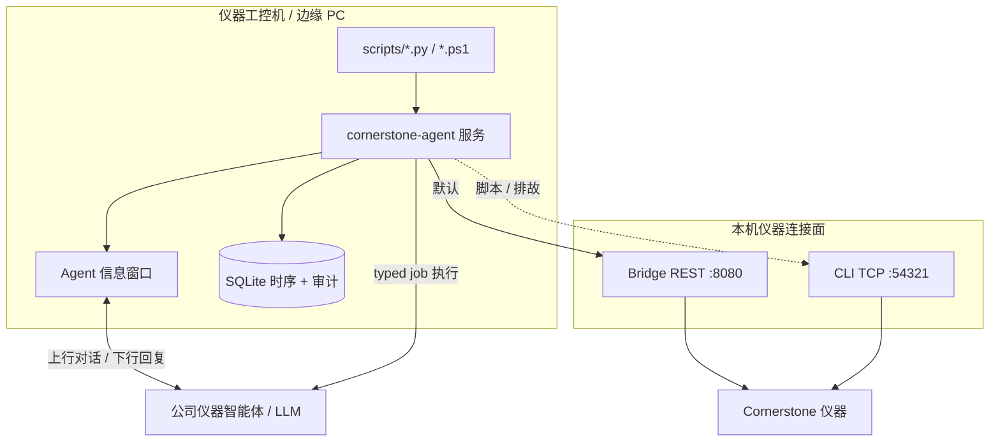

# CornerstoneAgent — 仪器驻场边缘执行服务

本文档定义 **CornerstoneAgent** 的产品定位、架构与实施阶段，与根目录 [PLAN.md](../PLAN.md) §3 对齐。Agent 部署在**仪器工控机或实验室边缘 PC**，负责**采集仪器参数**、**规则研判**、**执行公司仪器智能体下发的白名单任务**，并可通过**本地信息窗口**展示建议；量产场景下**对话与推理在公司侧（BaoClaw / 编排）**，边缘不另开对等聊天智能体。

与公司侧连接、任务目录与「转发 vs 对话」定界见 **[ENTERPRISE.md §0](ENTERPRISE.md)**。

---

## 1. 核心定位


| 维度              | 说明                                                                                                               |
| --------------- | ---------------------------------------------------------------------------------------------------------------- |
| **是什么**         | 仪器侧的「数据采集 + 规则顾问 + 公司智能体执行面」边缘服务；不替代 Bridge 网关，不直接改写仪器参数（除非未来显式白名单）。                                            |
| **不是什么**        | 不是第二个 Web 分析页；不是 Modbus/MQTT 北向；**不连接** Queue / 仪器日志；**不是**与 BaoClaw 对等的第二对话大脑；**不是**任意 LLM 命令的透明转发器。 |
| **与公司智能体 / LLM** | **Agent 负责事实与执行**：调度采集、跑规则、执行 typed job、脱敏回传；**BaoClaw / 大模型负责推理与话术**。本地窗口默认作**上行渠道**（用户话 + 快照 → 公司智能体 → 回复下行），非整机第二套多轮大脑。 |
| **默认原则**        | **规则优先、LLM 为辅**；规则命中可本地告警无需等模型；上行仅结构化字段与脱敏统计；可配置关闭上行 LLM，仅规则-only。                                                 |


---


## 2. 用户场景


### 2.1 长周期参数记录

- 按配置间隔（如 1 min / 5 min / 1 h）通过 **Bridge REST** 拉取：
  - `GET /api/status`、`GET /api/instrument/system-parameters`
  - `GET /api/instrument/counters`、诊断类 `status-check` / 漏气 / 系统检查等价接口
- 写入本地 **时序存储**（SQLite + 可选按日滚动 JSON/CSV 导出），支持：
  - 参数漂移对比（与昨日/上周同刻）
  - 维护周期提醒（计数器、运行小时、耗材阈值）
  - 离线续传队列（网络恢复后批量上报摘要，非原始谱图）


### 2.2 短期采集（会话/批次）

- 分析批次或排故会话期间**加密采样**（如每 10–30 s 或事件触发）：
  - `set-stats`、`set-reps`、关键 `Status` 字段（经 Bridge REST）
- 会话结束生成 **采集包**（`sessionId` + 时间范围 + 结构化 JSON），供规则引擎与单次 LLM 问答使用。
- **不**采集 Queue 状态，**不**尾随 `bridge.log` / 仪器 `log-data`。


### 2.3 规则建议（无 AI）

对分析数据与仪器状态做可配置规则，输出结构化建议，例如：


| 规则域  | 示例条件              | 建议级别            |
| ---- | ----------------- | --------------- |
| 精密度  | RSD% 超阈值、n 不足     | review / reject |
| QC   | 空白偏高、标准漂移         | 复核、重新校准提示       |
| 仪器状态 | 漏气失败、系统检查未通过、业务离线 | 维护 / 停机等        |


每条建议带 `ruleId`、`severity`、`timestamp`、`evidence`（引用字段路径），便于审计与 LLM 上下文拼接。

### 2.4 与公司智能体 / LLM 协作

```
实验员 / 运维
      │
      ▼
┌─────────────────┐     自然语言 + 快照上下文      ┌──────────────────┐
│ Agent 信息窗口   │ ◄─────────────────────────── │ 公司仪器智能体     │
│ (建议/对话展示)  │ ──用户问题 + session ─────► │ (BaoClaw / 编排)  │
└────────┬────────┘                               └────────┬─────────┘
         │ 本机采集 / 执行 typed job                         │ tool → job
         ▼                                                  ▼
┌────────────────────────────────────────────────────────────┐
│ Agent 核心                                                  │
│  · 采集调度  · 规则引擎  · job 执行与脱敏  · 心跳注册        │
└────────┬───────────────────────────────────────────────────┘
         │
    ┌────┴────┐
    ▼         ▼
 Bridge    CLI（TCP）
 REST      cornerstone-cli
 :8080     :54321
```

- **仪器连接面（仅此二者）**：
  - **Bridge REST** `http://…:8080` — 默认数据面（状态 / 参数 / 诊断）
  - **CLI TCP** `…:54321` — 脚本、批量与离线排故（`cornerstone-cli`）
- **明确不连接**：CornerstoneQueue、`bridge.log` / 仪器日志尾随、FlaUI 窗口检查。
- **LLM / BaoClaw 不直连仪器**：所有仪器访问经 Agent → Bridge（或紧急时 CLI TCP）。
- **公司侧 ↔ Agent**：结构化 **job / result / alert**（见 [ENTERPRISE.md §0.3](ENTERPRISE.md)），不是自由文本对聊。
- **信息窗口**：展示规则告警与公司智能体回复；追问时 Agent 自动附带最新短期采集包与长周期摘要。
- **断网 / 试点**：可降级为边缘直连 LLM（[ENTERPRISE.md §2.3](ENTERPRISE.md)）或规则-only。


### 2.5 正确使用、维护与排故

- **正确使用**：结合 `system-parameters`、方法/状态字段，LLM 生成操作检查清单（Agent 仅展示，不自动点击仪器按钮）。
- **快速维护**：规则触发维护项 + LLM 步骤说明（换件、校准、清零计数器等），链接到 Bridge/CLI 可执行的**只读诊断命令**说明（复制即用）。
- **排故**：短期采集（Bridge REST）+ 必要时 CLI TCP 诊断命令；不依赖 Queue / 仪器日志 / UI Inspect。

---


## 3. 技术架构


### 3.1 依赖边界


```mermaid
flowchart TB
  subgraph edge [仪器工控机 / 边缘 PC]
    WIN[Agent 信息窗口]
    CORE[cornerstone-agent 服务]
    SCR[scripts/*.py / *.ps1]
    STORE[(SQLite 时序 + 审计)]
    CORE --> WIN
    CORE --> STORE
    SCR --> CORE
  end
  subgraph local [本机仪器连接面]
    BR[Bridge REST :8080]
    CLI[CLI TCP :54321]
  end
  LLM[公司仪器智能体 / LLM]
  CS[Cornerstone 仪器]
  WIN <-->|上行对话 / 下行回复| LLM
  CORE -->|"typed job 执行"| LLM
  CORE -->|默认| BR
  CORE -.->|脚本 / 排故| CLI
  BR --> CS
  CLI --> CS
```


| 组件                   | 职责                                                         |
| -------------------- | ---------------------------------------------------------- |
| `cornerstone-agent`  | 主进程：调度、存储、规则、job 执行、窗口 UI（上行渠道）                         |
| Bridge REST `:8080`  | 唯一推荐的仪器数据面（REST + 已解析 JSON）；Agent 默认连接此端口                  |
| CLI TCP `:54321`     | `cornerstone-cli` 网关端口；脚本与离线排故，Agent 以库或子进程调用，不重复实现协议       |
| 公司智能体 / LLM         | BaoClaw 或网关；密钥与会话在公司侧；边缘仅持注册 token                      |
| Queue / 仪器日志         | **不连接**：不读 Queue、不尾随 `bridge.log` / 仪器日志                   |


### 3.2 采集实现路径


| 路径                 | 用途       | 说明                                                                              |
| ------------------ | -------- | ------------------------------------------------------------------------------- |
| **Bridge REST** `:8080` | 默认       | `/api/status`、`/api/instrument/*`、`/api/diagnostic/*`                            |
| **CLI TCP** `:54321`    | 批量/排故/CI | `CornerstoneAgent/scripts/` 包装 `cornerstone-cli tcp …`（连本机 `54321`），由 Agent 调度或 cron 调用 |
| ~~本地日志 / Queue / UI Inspect~~ | **不做** | 不连接 Queue，不尾随仪器日志，不做 FlaUI 窗口检查                                               |


### 3.3 配置要点（规划）

示例文件：`cornerstone-agent.config.toml`（待实现）


| 配置块                 | 键（示例）                                         | 含义                               |
| ------------------- | --------------------------------------------- | -------------------------------- |
| `bridge`            | `base_url`                                    | 默认 `http://127.0.0.1:8080`       |
| `cli`               | `host`, `port`                                | 默认 `127.0.0.1:54321`（TCP 网关）     |
| `acquisition.long`  | `interval_s`, `endpoints[]`                   | 长周期拉取列表                          |
| `acquisition.short` | `interval_s`, `duration_s`, `triggers[]`      | 短期会话采集                           |
| `storage`           | `db_path`, `retention_days`                   | SQLite 与保留策略                     |
| `rules`             | `file` / 内嵌 YAML                              | 规则定义路径                           |
| `llm`               | `enabled`, `base_url`, `model`, `api_key_env` | 云端模型；`enabled=false` 时仅规则+窗口本地提示 |
| `window`            | `mode=tray|panel`, `always_on_top`            | 信息窗口行为                           |
| `privacy`           | `redact_sample_names`                         | 脱敏与上传边界（不含日志行采集）                 |


### 3.4 审计与追溯

所有输出（规则建议、LLM 回复、采集包引用）写入：

- `agent_audit` 表：`(id, ts, type, rule_id?, model?, prompt_hash?, response_summary, session_id)`
- 关联 `acquisition_snapshot_id`，满足合规「可解释、可回放结构化证据」。

---


## 4. CLI 与脚本约定（规划）

主入口：`cornerstone-agent`（与 `cornerstone-cli` 并列安装）


| 子命令                              | 作用                         |
| -------------------------------- | -------------------------- |
| `run`                            | 启动常驻服务 + 信息窗口              |
| `collect once`                   | 单次拉取并打印/存储 JSON            |
| `collect session --duration 30m` | 短期采集会话                     |
| `rules eval`                     | 对当前数据跑规则，输出建议 JSON         |
| `ask "…"`                        | 带上下文调用云端 LLM（CLI 排故，无 GUI） |


`scripts/` 目录提供可编排示例：`record-parameters.ps1`、`troubleshoot-status.ps1`、`export-session-for-llm.py`。

---


## 5. 信息窗口（LLM 输出面）


| 区域      | 内容                                 |
| ------- | ---------------------------------- |
| **状态条** | Bridge `:8080` 在线、CLI `:54321`、最近采集时间、LLM 连接/规则-only 模式 |
| **告警区** | 规则引擎实时建议（可确认/静默）                   |
| **对话区** | 用户问题与云端 LLM 回复；支持「插入当前仪器快照」快捷操作    |
| **证据区** | 展开本次回复引用的参数表、统计摘要（不含日志 / Inspect）  |


技术选型（建议）：与 Bridge UI 一致用 **PySide6** 小窗 + 系统托盘。首版优先 **PySide6**，便于与 `cornerstone-bridge-ui` 共用打包经验。

---


## 6. 实施阶段


| 阶段     | 内容                                | 验收                         |
| ------ | --------------------------------- | -------------------------- |
| **A0** | 包骨架、`BridgeApiClient`、示例配置、C1 编排 HTTP（注册表 + P0/P1 tools） | ✅ P0 查数 + P1 `collect`；长周期/规则未做 |
| **A1** | 长/短周期调度 + SQLite 时序 | ✅ 多任务：Widgets 10s/3d、Ambients 5min/90d；清单=查询命令；单机或全部设备；运维台可保存热加载 |
| **A2** | 规则引擎 v1 + 本地建议 JSON | RSD/状态类规则可配置（不含队列规则） |
| **A3** | 云端 LLM 客户端 + 脱敏策略                 | `ask` 与信息窗口可对话，可关闭 LLM     |
| **A4** | CLI `:54321` 脚本与排故封装              | 排故会话端到端：采集→规则→LLM→窗口       |
| **A5** | 运维：心跳、配置热加载、离线队列、安装包组件            | 7×24 驻场；installer 可选 Agent |


与 [PLAN.md](../PLAN.md) 里程碑关系：**A1–A2** 对应原「规则监控/审核」；**A3–A4** 将 AI 明确为**云端 LLM + Agent 采集闭环**，信息窗口为新增交付物。

---


## 7. 与现有组件协同


| 组件            | 协同方式                                                    |
| ------------- | ------------------------------------------------------- |
| **Bridge** `:8080` | Agent 唯一主数据通道（REST）；北向 MQTT 可转发 Agent 告警摘要（Bridge P2+） |
| **CLI** `:54321`   | 脚本 / 排故备用通道；Agent 经 `cornerstone-cli` 连接 TCP 网关        |
| **Web**       | Web 继续做人机分析图表；Agent 不重复 ECharts，可提供 deep link 到 Web 分析页 |
| **Queue / 仪器日志** | **不协同、不连接**；发样与日志查看仍由既有工具独立完成                          |
| **Bridge UI** | 运维看网关日志；Agent 看仪器建议，职责分离                                |


---


## 8. 安全与合规

- API Key 不得写入仓库；使用环境变量或 Windows 凭据。
- 默认不上传样品名/客户标识；谱图仅统计摘要（均值、RSD、峰面积区间等）。
- LLM 请求超时、失败时回退为**仅规则建议**。
- 禁止 LLM 输出直接映射为仪器写操作（无自动 `AddSamples`/RC 写）。

---


## 9. 待细化产物

- [INTERFACE.md](INTERFACE.md) — BaoClaw tool ↔ Agent job 接口表（草案 v0.1 ✅）
- `schemas/agent-job.v1.json` / `agent-result.v1.json` / `baoclaw-tools.v1.json` — 由 INTERFACE 拆出的可加载 Schema
- `schemas/suggestion.json` — 规则/LLM 统一建议结构
- `schemas/acquisition-snapshot.json` — 短期采集包
- `rules/default.yaml` — 开箱规则集
- 安装包：`installer` 增加可选「Cornerstone Agent」组件与服务注册

---


## 10. 企业部署（星火 / 盘古 / 多实验室 / 企业微信）

公司若已部署 **BaoClaw 仪器智能体**（或讯飞星火 / 华为盘古 + 编排），并存在 **多实验室、多仪器**：

- **对话大脑在公司**；边缘 Agent 执行 **typed job**，不做对等聊天智能体（[ENTERPRISE.md §0](ENTERPRISE.md)）。
- 模型通过 **工具调用**（如 `collect_instrument(lab_id, instrument_id, …)`）指挥采集；编排层按注册表把任务推到**指定 Agent**。
- **宝武聊天 / 企业微信** 为用户入口；Agent 不直接对接渠道 API。

完整架构、任务目录、序列图与阶段 **E1–E5** 见 **[ENTERPRISE.md](ENTERPRISE.md)**。

---

*文档版本：与仓库 PLAN §3 同步；仪器连接面固定为 Bridge `:8080` + CLI TCP `:54321`，不连接 Queue / 仪器日志；企业扩展见 ENTERPRISE.md §0。*