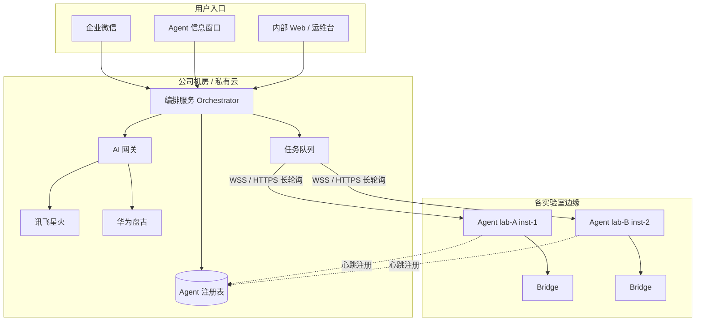
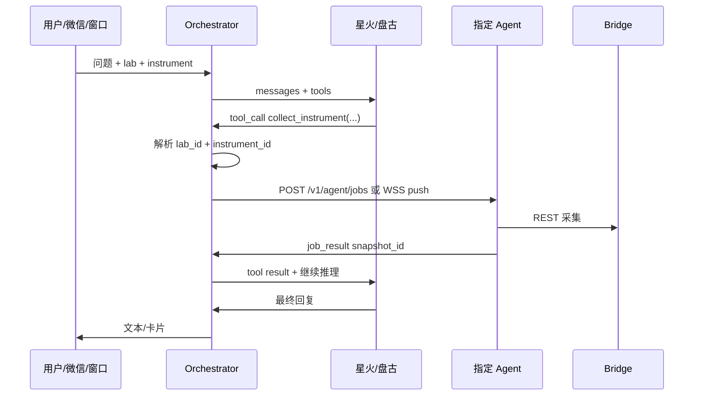

# 企业部署：多模型、多实验室、企业微信

本文档说明在公司已部署 **讯飞星火**、**华为盘古** 的前提下，CornerstoneAgent 如何对接模型；**多实验室、多仪器** 时模型如何指挥**指定 Agent** 采集；以及 **企业微信（WeCom）** 作为用户入口调用大模型的推荐架构。

与 [AGENT.md](AGENT.md) 的关系：边缘 **Agent 仍只连本机 Bridge**；模型与微信均通过公司侧 **编排服务（Orchestrator）** 间接交互，避免每台工控机配置多套大模型密钥。

---

## 1. 总体原则

| 原则 | 说明 |
|------|------|
| **模型不直连仪器** | 星火/盘古只做推理与话术；仪器数据仅由 Agent 经 Bridge/CLI 采集。 |
| **Agent 不内置各厂商全套 SDK（推荐）** | 工控机只连公司 **AI 网关**；网关统一鉴权、审计、路由星火/盘古。 |
| **多租户靠身份与任务队列** | `org → lab → instrument → agent_id` 全局唯一；模型通过 **工具调用（function calling）** 或编排 DSL 指定目标，不靠自然语言「猜」是哪台仪器。 |
| **微信是渠道，不是模型** | 企业微信机器人/应用消息 → 编排服务 → 选模型 + 选 Agent → 回写微信。 |



---

## 2. 与讯飞星火、华为盘古对接

### 2.1 推荐：公司 AI 网关 + 统一 `LlmClient` 接口

在 **编排服务**（新建，如 `cornerstone-orchestrator`，Python/FastAPI）实现模型适配层，对 Agent 与微信侧只暴露一种 HTTP API：

```
POST /v1/chat/completions   # 或公司内部等价路径
{
  "model": "spark-max" | "pangu-agent" | "auto",
  "messages": [...],
  "tools": [ { "name": "collect_instrument", ... } ],
  "tenant": { "org_id", "lab_id" }
}
```

| 适配器 | 对接方式（示例） | 配置项 |
|--------|------------------|--------|
| **讯飞星火** | 开放平台 [WebAPI](https://www.xfyun.cn/doc/spark/Web.html) 或私有化部署 endpoint；鉴权多为 APPID + APIKey + APISecret（或企业统一 token） | `spark.app_id`, `spark.api_key`, `spark.api_secret`, `spark.domain`（如 generalv3.5） |
| **华为盘古** | ModelArts / 盘古大模型 **推理 API**（REST）；企业内网常为专属 `base_url` + AK/SK 或 IAM token | `pangu.endpoint`, `pangu.project_id`, `pangu.model_name`, 凭据走环境变量 |
| **路由策略** | `model=auto` 时按任务类型选模型（如排故→盘古、话术润色→星火），或按实验室配置表 | `labs/{lab_id}/preferred_model` |

**Agent 侧（边缘）** 两种模式二选一：

| 模式 | 适用 | Agent 行为 |
|------|------|--------------|
| **A. 经编排服务（推荐）** | 多实验室、要审计与统一密钥 | Agent 只 `POST /v1/agent/sessions/{id}/ask` 到 Orchestrator；**不持有**星火/盘古密钥 |
| **B. Agent 直连网关** | 单 lab 试点 | Agent 配置 `llm.gateway_url` + 工控机证书；仍不直连星火/盘古多个 endpoint |

不推荐在每台仪器 PC 上分别配置星火与盘古两套密钥（轮换与合规成本高）。

### 2.2 工具调用（让模型「指挥采集」）

大模型不发送 TCP 到仪器，而是返回结构化 **tool call**，由编排服务转成 **Agent 任务**：

```json
{
  "tool": "collect_instrument",
  "arguments": {
    "lab_id": "shanghai-chem",
    "instrument_id": "CS-8832-01",
    "profile": "troubleshoot",
    "endpoints": ["status", "system-parameters", "set-stats"],
    "duration_s": 120
  }
}
```

编排服务校验调用方权限后，向对应 Agent 下发任务（见 §3）。

### 2.3 若必须 Agent 本地调模型（不推荐量产）

在 `cornerstone-agent` 内实现可插拔 `LlmProvider`：

```python
class LlmProvider(Protocol):
    async def chat(self, messages, tools=None) -> ChatResult: ...

class SparkProvider(LlmProvider): ...   # 星火 WebSocket/HTTP
class PanguProvider(LlmProvider): ...   # 盘古 REST
class GatewayProvider(LlmProvider): ... # 转发到公司网关
```

配置 `llm.provider = gateway | spark | pangu`，默认 **gateway**。

---

## 3. 多实验室、多仪器：模型如何指挥「这一台」Agent

### 3.1 身份模型

每台工控机一个 Agent 实例，启动时带不可伪造身份（证书或注册 token）：

| 字段 | 示例 | 说明 |
|------|------|------|
| `org_id` | `acme` | 集团 |
| `lab_id` | `lab-sh-01` | 实验室 |
| `instrument_id` | `LECO-CS-8832-SN123` | 逻辑仪器 ID（与 Bridge `upstream` 配置一致） |
| `agent_id` | `agent-a1b2c3` | UUID，实例级 |
| `bridge_url` | `http://127.0.0.1:8081` | 本机 Bridge |

注册表示例（Orchestrator 侧 Redis/PostgreSQL）：

```
agent_id → { lab_id, instrument_id, last_seen, capabilities[], bridge_reachable }
```

Agent 每 30–60 s **心跳**：`POST /v1/agents/register` + `capabilities: ["long_poll", "short_session", "ui_inspect"]`。

### 3.2 任务下发路径



| 通道 | 优点 | 说明 |
|------|------|------|
| **WSS 长连接** | 实时、可服务端 push | Agent 出站连 Orchestrator（工控机常无公网 IP） |
| **HTTPS 长轮询** | 防火墙友好 | `GET /v1/agent/jobs/wait?timeout=60` |
| **MQTT** | 与 Bridge 北向统一 | topic：`cmd/{org}/{lab}/{instrument}/collect` |

任务体（Agent 收到后执行，**幂等** `job_id`）：

```json
{
  "job_id": "job-uuid",
  "type": "collect",
  "profile": "troubleshoot",
  "endpoints": ["status", "system-parameters"],
  "duration_s": 0,
  "reply_to": "https://orchestrator/v1/agent/jobs/job-uuid/result"
}
```

Agent 完成后 `POST` 结构化结果（脱敏后的 `acquisition-snapshot`），Orchestrator 再喂回模型。

### 3.3 模型如何「知道」调哪台仪器

三种互补机制，**至少启用 (1)+(2)**：

1. **显式上下文（必选）**  
   用户在微信/窗口选择实验室与仪器，或消息带 `#lab-sh-01 #CS-8832`。Orchestrator 注入 system prompt：「当前仅允许操作 instrument_id=…」。

2. **工具参数（必选）**  
   `collect_instrument` 的 JSON schema 要求 `lab_id` + `instrument_id`；编排服务校验与注册表一致，否则拒绝并返回「仪器离线/无权限」。

3. **检索增强（可选）**  
   用户只说「上海有机楼 8832 漏气」→ Orchestrator 用内部目录 RAG 解析为 `instrument_id`，再下发任务；**解析结果写入审计日志**，人工可纠错。

**禁止**：仅靠模型自由文本让 Agent 猜测 Bridge 地址。

### 3.4 多 Bridge、多仪器拓扑

```
实验室 A ── PC1 ── Bridge ── 仪器 1
              └── Agent-1 (instrument_id=inst-1)

实验室 B ── PC2 ── Bridge ── 仪器 2
              └── Agent-2 (instrument_id=inst-2)
```

一台 PC 多台仪器（少见）：多个 Bridge 进程/端口 → 多个 Agent 实例或单 Agent 多 `bridge_url` profile（配置多个 `instrument_id` 映射）。

---

## 4. 企业微信调用大模型

### 4.1 可以，且推荐作为「渠道层」

企业微信 **不直接** 连星火/盘古；标准链路：

```
实验员 @机器人 或 应用消息
    → 企业微信服务器
    → 公司「WeCom 回调服务」（公网 URL + 加解密）
    → Orchestrator（鉴权用户、解析 lab/instrument）
    → AI 网关（星火/盘古）
    → 如需最新数据：下发 Agent 采集任务
    → 回复文本 / 图文卡片 / 模板消息
```

### 4.2 接入形态

| 形态 | 适用 | 要点 |
|------|------|------|
| **自建应用 + 接收消息 API** | 内部运维/实验员问答 | [企业微信开发者文档](https://developer.work.weixin.qq.com/document/)：URL 验证、AES 加解密、`userid` 映射公司 AD |
| **群机器人 Webhook** | 单向告警推送 | Agent 规则告警 → Orchestrator → Webhook；**不适合**复杂多轮采集（无回调） |
| **微信小程序 / H5** | 选实验室、选仪器 | 与 Orchestrator 会话绑定，体验优于纯聊天 |

### 4.3 会话与权限

| 项 | 做法 |
|----|------|
| 身份 | `userid` → 公司目录 → 允许的 `lab_id[]` |
| 仪器选择 | 首次对话下发「可选仪器」卡片；或企业微信 **菜单** 固定 lab |
| 脱敏 | 出网至星火/盘古前 Orchestrator 统一脱敏（与 Agent 策略一致） |
| 审计 | 保存 `msg_id`、模型版本、引用的 `snapshot_id` |

### 4.4 典型对话示例

```
用户（企业微信）: 8832 现在能跑样吗？
Orchestrator: 解析 instrument_id → 下发 collect(status, system-parameters)
Agent: 120s 内返回快照
Orchestrator: 星火/盘古 生成回复
企业微信: 「业务在线，漏气检查通过；建议…」附「查看证据」链接（内网 H5）
```

---

## 5. 组件职责一览

| 组件 | 部署位置 | 职责 |
|------|----------|------|
| **cornerstone-agent** | 各仪器工控机 | 采集、规则、执行 `job`、可选本地信息窗口 |
| **cornerstone-bridge** | 同上 | 仪器协议与 REST |
| **cornerstone-orchestrator**（规划） | 公司机房 | 注册表、任务队列、会话、工具调用编排 |
| **AI 网关** | 公司机房 | 星火/盘古 适配、限流、审计 |
| **WeCom 回调服务** | 公司机房（公网入口） | 微信加解密、用户映射 |
| **星火 / 盘古** | 公司指定环境 | 仅推理 API |

---

## 6. 配置草案（Orchestrator / Agent）

**Agent** `cornerstone-agent.config.toml`：

```toml
[identity]
org_id = "acme"
lab_id = "lab-sh-01"
instrument_id = "CS-8832-01"

[orchestrator]
base_url = "https://ai-gateway.corp.example"
register_token_env = "CORNERSTONE_AGENT_TOKEN"
transport = "websocket"  # websocket | long_poll | mqtt

[llm]
# 推荐：不在边缘配置星火/盘古
mode = "orchestrator"  # orchestrator | gateway
```

**Orchestrator** `models.toml`（示例）：

```toml
[spark]
enabled = true
app_id_env = "SPARK_APP_ID"
api_key_env = "SPARK_API_KEY"
api_secret_env = "SPARK_API_SECRET"
domain = "generalv3.5"

[pangu]
enabled = true
endpoint = "https://modelarts.xxx.cn-north-4.myhuaweicloud.com/..."
model_name = "pangu-agent"
ak_env = "PANGU_AK"
sk_env = "PANGU_SK"

[routing]
default = "spark"
troubleshoot = "pangu"
```

---

## 7. 实施阶段（企业能力）

在 [AGENT.md](AGENT.md) A0–A5 之后叠加：

| 阶段 | 内容 | 验收 |
|------|------|------|
| **E1** | AI 网关：`spark` + `pangu` 适配器 + OpenAI 兼容 API | 单 lab 脚本可对话 |
| **E2** | Orchestrator：Agent 注册/心跳 + `collect` 任务下发 | 指定 `instrument_id` 能拉回快照 |
| **E3** | 工具调用闭环：模型 → tool → Agent → 再推理 | 端到端排故话术 |
| **E4** | 企业微信回调 + 用户/实验室权限 | 微信提问能触发指定仪器采集 |
| **E5** | 审计、限流、多模型路由策略 | 合规评审通过 |

---

## 8. 安全与合规（企业）

- 星火/盘古 **密钥仅存在于网关/Orchestrator**，不下发工控机。
- Agent 与 Orchestrator 之间 **mTLS 或签名 token**；`job` 带 `job_id` 防重放。
- 企业微信回调 URL 校验与 IP 白名单；消息内容不出境（若盘古/星火为私有化则全内网）。
- 模型输出仅作建议；关键操作（停机等）需人工确认或二次审批（可在 Orchestrator 配置）。

---

## 9. 常见问题

**Q：Agent 能否直接调星火 API？**  
A：可以但不推荐。试点可用 `LlmProvider=spark`；量产应走网关，便于换模型与审计。

**Q：一个模型如何同时管 50 台仪器？**  
A：模型不直连 50 台；Orchestrator 维护注册表，每次 tool call 带 `instrument_id`，并行下发多个 `job`（注意仪器侧 Bridge 并发与 `instrument_rq` 互斥由单 Bridge 保证）。

**Q：微信里如何选仪器？**  
A：菜单/卡片/H5 绑定 `instrument_id`；或自然语言 + 内部目录 RAG，但必须经 Orchestrator 校验后再下发 Agent。

**Q：仪器无外网怎么办？**  
A：Agent **主动出站** WSS 到 Orchestrator；星火/盘古部署在内网机房，与 Orchestrator 同域；企业微信回调服务在有公网的 DMZ，只传脱敏摘要与回复文本。

---

*文档版本：2026-05，与 AGENT.md 企业扩展配套。*
