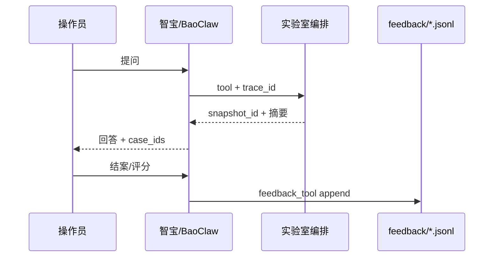

# BaoClaw Tool ↔ Agent Job 接口表（草案 v0.1）

对齐 **公司仪器智能体（BaoClaw）** 声明的 tool schema 与 **CornerstoneAgent** 执行的 typed job JSON。职责定界见 [ENTERPRISE.md §0](ENTERPRISE.md)。

| 版本 | 状态 | 说明 |
|------|------|------|
| v0.1 | 草案 | POC / C1 对话查数；写仪器类 tool **不开放** |

**约定**

1. BaoClaw 侧 tool 参数含 `lab_id` + `instrument_id`（或会话已绑定二者）；编排层校验注册表后 **剥掉路由字段**，下发到 Agent 的 job **不再携带** 目标地址猜测空间。
2. Agent job 以 `job_id` 幂等；重复投递同一 `job_id` 返回首次结果或 `status=duplicate`。
3. Agent → Bridge **仅白名单 GET（及只读语义）**；例外：`POST /api/operator-notices`（操作员建议下行，只展示不写仪器）。本表列出的 Bridge 路径为允许集。
4. 回传默认脱敏：样品名 / 客户标识可配置为 hash 或剔除；谱图仅统计摘要。

---

## 1. 总对照表

| BaoClaw tool `name` | Agent `job.type` | Bridge（Agent 内调用） | POC 优先级 |
|---------------------|------------------|------------------------|------------|
| `list_instruments` | （编排本地，不下发） | — | P0 |
| `get_instrument_status` | `get_status` | `GET /api/status`；可选 `system-parameters`、`status-check` | P0 |
| `get_analysis_sets` | `get_sets` | `GET /api/instrument/sets` | P0 |
| `get_set_reps` | `get_set_reps` | `GET /api/instrument/set-reps`；可选 `set-stats` | P0 |
| `collect_instrument` | `collect` | 见 §4 profile → endpoints | P1 ✅ |
| `post_operator_notice` | `operator_notice` | `POST /api/operator-notices`（Bridge 操作员对话框，只展示） | D1 ✅ |
| `eval_instrument_rules` | `rules_eval` | 读本地快照 / 现采后再评 | P2 |
| `tail_instrument_logs` | `log_tail` | 本地 `bridge.log`（非 Bridge HTTP） | P2 |
| `inspect_instrument_ui` | `ui_inspect` | FlaUI（可选能力） | P3 |
| — | `register` / `heartbeat` | —（Agent 主动上行） | P0 基建 |
| — | `alert`（上行事件） | — | P2 |

---

## 2. 公共信封

### 2.1 BaoClaw → 编排（tool call 公共参数）

所有仪器相关 tool 共享（可在 JSON Schema 用 `$defs` 引用）：

```json
{
  "lab_id": { "type": "string", "description": "实验室 ID，如 lab-sh-01" },
  "instrument_id": { "type": "string", "description": "逻辑仪器 ID，与 Agent 注册一致" },
  "timeout_s": { "type": "integer", "minimum": 5, "maximum": 300, "default": 60 }
}
```

编排层：查注册表 → 选 `agent_id` → 生成 `job_id` → 投递。

### 2.2 编排 → Agent（job 信封）

```json
{
  "schema_version": "agent-job.v1",
  "job_id": "550e8400-e29b-41d4-a716-446655440000",
  "type": "get_status",
  "created_at": "2026-07-24T06:00:00Z",
  "timeout_s": 60,
  "reply_to": "https://orchestrator.example/v1/agent/jobs/550e8400-e29b-41d4-a716-446655440000/result",
  "trace_id": "trc-...",
  "params": {}
}
```

| 字段 | 必填 | 说明 |
|------|------|------|
| `schema_version` | 是 | 固定 `agent-job.v1` |
| `job_id` | 是 | UUID；幂等键 |
| `type` | 是 | 见总对照表 |
| `created_at` | 是 | ISO8601 UTC |
| `timeout_s` | 否 | 默认 60；Agent 超时回 `status=timeout` |
| `reply_to` | 条件 | HTTP 回传 URL；WSS 模式下可省略，结果走同一连接 |
| `trace_id` | 否 | 贯通 BaoClaw 会话与审计 |
| `params` | 是 | 各 type 专用；可为 `{}` |

### 2.3 Agent → 编排（result 信封）

```json
{
  "schema_version": "agent-result.v1",
  "job_id": "550e8400-e29b-41d4-a716-446655440000",
  "type": "get_status",
  "status": "ok",
  "finished_at": "2026-07-24T06:00:02Z",
  "agent_id": "agent-a1b2c3",
  "instrument_id": "CS-8832-01",
  "bridge_reachable": true,
  "error": null,
  "data": {},
  "meta": {
    "duration_ms": 1820,
    "bridge_base_url": "http://127.0.0.1:8081",
    "redaction": "sample_names_hashed"
  }
}
```

| `status` | 含义 |
|----------|------|
| `ok` | 成功，`data` 有效 |
| `error` | 执行失败，见 `error.code` |
| `timeout` | 超时 |
| `rejected` | 未知 type / 缺能力 / 参数非法 |
| `duplicate` | 同 `job_id` 已完成，可附首次 `data` |

| `error.code`（示例） | 说明 |
|----------------------|------|
| `bridge_unreachable` | Bridge 连不上 |
| `bridge_http_error` | Bridge 非 2xx |
| `instrument_busy` | 仪器/会话忙（可选） |
| `capability_missing` | 如无 `ui_inspect` |
| `invalid_params` | 参数校验失败 |
| `unknown_type` | 非白名单 type |

---

## 3. 各 tool / job 细则

### 3.1 `list_instruments`（仅编排，不下发 Agent）

**用途**：让模型知道当前会话可操作哪些仪器。

**BaoClaw tool schema**

```json
{
  "name": "list_instruments",
  "description": "列出当前用户有权访问且在线/注册过的 Cornerstone 仪器。选仪器后再调用采集类工具。",
  "parameters": {
    "type": "object",
    "properties": {
      "lab_id": { "type": "string", "description": "可选，按实验室过滤" },
      "online_only": { "type": "boolean", "default": true }
    },
    "additionalProperties": false
  }
}
```

**编排返回（tool result 示例）**

```json
{
  "instruments": [
    {
      "lab_id": "lab-sh-01",
      "instrument_id": "CS-8832-01",
      "agent_id": "agent-a1b2c3",
      "online": true,
      "last_seen": "2026-07-24T05:59:00Z",
      "capabilities": ["collect", "get_sets", "rules_eval"]
    }
  ]
}
```

---

### 3.2 `get_instrument_status` ↔ `get_status`

**BaoClaw tool schema**

```json
{
  "name": "get_instrument_status",
  "description": "查询指定仪器在线与业务状态（能否跑样、漏气/系统检查等摘要）。需要 lab_id 与 instrument_id。",
  "parameters": {
    "type": "object",
    "required": ["lab_id", "instrument_id"],
    "properties": {
      "lab_id": { "type": "string" },
      "instrument_id": { "type": "string" },
      "include_system_parameters": { "type": "boolean", "default": false },
      "include_status_check": { "type": "boolean", "default": true },
      "timeout_s": { "type": "integer", "default": 60 }
    },
    "additionalProperties": false
  }
}
```

**Agent job**

```json
{
  "schema_version": "agent-job.v1",
  "job_id": "...",
  "type": "get_status",
  "timeout_s": 60,
  "params": {
    "include_system_parameters": false,
    "include_status_check": true
  }
}
```

**Agent → Bridge**

| 条件 | 方法与路径 |
|------|------------|
| 始终 | `GET /api/status` |
| `include_system_parameters` | `GET /api/instrument/system-parameters` |
| `include_status_check` | `GET /api/diagnostic/status-check` |

**`data` 草案（Agent 归一化后）**

```json
{
  "summary": {
    "bridge_ok": true,
    "business_online": true,
    "ready_hint": "online_ok",
    "bridge_version": "0.1.17"
  },
  "status": { "...": "raw /api/status；可选含 bridgeVersion" },
  "status_check": { "...": "可选" },
  "system_parameters": { "...": "可选，已裁剪" }
}
```

`summary.bridge_version` / `status.bridgeVersion` 为可选字段：旧 Bridge 无该字段时省略，不视为错误。

---

### 3.3 `get_analysis_sets` ↔ `get_sets`

**BaoClaw tool schema**

```json
{
  "name": "get_analysis_sets",
  "description": "查询仪器近期分析集（sets）列表摘要，用于回答分析结果相关问题。",
  "parameters": {
    "type": "object",
    "required": ["lab_id", "instrument_id"],
    "properties": {
      "lab_id": { "type": "string" },
      "instrument_id": { "type": "string" },
      "number": { "type": "integer", "minimum": 1, "maximum": 50, "default": 10 },
      "start_at": { "type": "integer", "default": -1 },
      "filter_key": { "type": "string", "default": "0" },
      "timeout_s": { "type": "integer", "default": 90 }
    },
    "additionalProperties": false
  }
}
```

**Agent job**

```json
{
  "schema_version": "agent-job.v1",
  "job_id": "...",
  "type": "get_sets",
  "params": {
    "number": 10,
    "start_at": -1,
    "filter_key": "0"
  }
}
```

**Agent → Bridge**

`GET /api/instrument/sets?number=&start_at=&filter_key=`

**`data`**：Bridge JSON 经脱敏后放入；可另附 `sets_summary[]`（set_key、时间、主要元素均值/RSD）供模型少 token 使用。

---

### 3.4 `get_set_reps` ↔ `get_set_reps`

**BaoClaw tool schema**

```json
{
  "name": "get_set_reps",
  "description": "按 set_key 查询某次分析的重复性（reps）与可选统计（set-stats）。",
  "parameters": {
    "type": "object",
    "required": ["lab_id", "instrument_id", "set_key"],
    "properties": {
      "lab_id": { "type": "string" },
      "instrument_id": { "type": "string" },
      "set_key": { "type": "string" },
      "include_detail": { "type": "boolean", "default": false },
      "include_stats": { "type": "boolean", "default": true },
      "tag": { "type": "integer", "default": -1 },
      "timeout_s": { "type": "integer", "default": 90 }
    },
    "additionalProperties": false
  }
}
```

**Agent job**

```json
{
  "schema_version": "agent-job.v1",
  "job_id": "...",
  "type": "get_set_reps",
  "params": {
    "set_key": "...",
    "include_detail": false,
    "include_stats": true,
    "tag": -1
  }
}
```

**Agent → Bridge**

| 条件 | 路径 |
|------|------|
| 始终 | `GET /api/instrument/set-reps?set_key=&include_detail=&tag=` |
| `include_stats` | `GET /api/instrument/set-stats?set_key=`（及 Bridge 要求的其它 query） |

---

### 3.5 `collect_instrument` ↔ `collect`

**BaoClaw tool schema**

```json
{
  "name": "collect_instrument",
  "description": "按采集档位拉取一组只读仪器数据，组装 acquisition-snapshot，供排故或深度问答。优先用 get_* 轻量工具；本工具更重。",
  "parameters": {
    "type": "object",
    "required": ["lab_id", "instrument_id", "profile"],
    "properties": {
      "lab_id": { "type": "string" },
      "instrument_id": { "type": "string" },
      "profile": {
        "type": "string",
        "enum": ["status_light", "analysis_recent", "troubleshoot", "custom"]
      },
      "endpoints": {
        "type": "array",
        "items": { "type": "string" },
        "description": "仅 profile=custom 时生效；必须是白名单 endpoint 别名"
      },
      "duration_s": {
        "type": "integer",
        "minimum": 0,
        "maximum": 600,
        "default": 0,
        "description": "0=单次快照；>0 为短期会话采样秒数"
      },
      "timeout_s": { "type": "integer", "default": 120 }
    },
    "additionalProperties": false
  }
}
```

**Agent job**

```json
{
  "schema_version": "agent-job.v1",
  "job_id": "...",
  "type": "collect",
  "params": {
    "profile": "troubleshoot",
    "endpoints": [],
    "duration_s": 0
  }
}
```

**`data`**

```json
{
  "snapshot_id": "snap-...",
  "profile": "troubleshoot",
  "captured_at": "2026-07-24T06:01:00Z",
  "endpoints": {
    "status": {},
    "system-parameters": {},
    "status-check": {},
    "set-stats": {}
  }
}
```

Profile → endpoint 别名见 §4。

---

### 3.5b `post_operator_notice` ↔ `operator_notice`（D1）

向仪器侧 **Bridge 操作员对话框** 下发运维/检修建议。**只展示与确认，不写仪器**。`severity=reject|maintain` 时 Bridge UI 置顶弹窗。

**BaoClaw tool schema**（摘要，完整见 `schemas/baoclaw-tools.v1.json`）

```json
{
  "name": "post_operator_notice",
  "parameters": {
    "type": "object",
    "required": ["lab_id", "instrument_id", "title", "message"],
    "properties": {
      "severity": { "enum": ["info", "review", "reject", "maintain"] },
      "source": { "enum": ["zhibao", "orchestrator", "agent_rule", "manual"] },
      "evidence": { "type": "array" },
      "actions": { "type": "array" },
      "require_ack": { "type": "boolean", "default": true },
      "notice_id": { "type": "string" }
    }
  }
}
```

**Agent**：`POST {bridge}/api/operator-notices`；本地审计 `operator_notices.jsonl`。  
**回执**：现场 ack 后，编排 `POST /api/ui/operator-notices/sync` 从 Bridge 拉取并回写审计（供后续智宝会话备注）。  
**预留**：A2 规则命中可直接调用同一 `handle_operator_notice`（同一管道）。

---

### 3.6 `eval_instrument_rules` ↔ `rules_eval`

**BaoClaw tool schema**

```json
{
  "name": "eval_instrument_rules",
  "description": "对当前仪器数据或已有 snapshot 运行边缘规则引擎，返回结构化建议（精密度/QC/状态等）。",
  "parameters": {
    "type": "object",
    "required": ["lab_id", "instrument_id"],
    "properties": {
      "lab_id": { "type": "string" },
      "instrument_id": { "type": "string" },
      "snapshot_id": { "type": "string", "description": "省略则先轻量采集再评" },
      "rule_domains": {
        "type": "array",
        "items": { "type": "string", "enum": ["precision", "qc", "instrument", "queue"] }
      },
      "timeout_s": { "type": "integer", "default": 90 }
    },
    "additionalProperties": false
  }
}
```

**Agent job `params`**

```json
{
  "snapshot_id": null,
  "rule_domains": ["precision", "instrument"]
}
```

**`data.suggestions[]`**：`rule_id`, `severity` (`info|review|reject|maintain`), `message`, `evidence[]`, `timestamp`。

---

### 3.7 `tail_instrument_logs` ↔ `log_tail`

**BaoClaw tool schema**

```json
{
  "name": "tail_instrument_logs",
  "description": "读取工控机侧 Bridge/仪器相关日志尾部，用于排故。有行数上限。",
  "parameters": {
    "type": "object",
    "required": ["lab_id", "instrument_id"],
    "properties": {
      "lab_id": { "type": "string" },
      "instrument_id": { "type": "string" },
      "source": { "type": "string", "enum": ["bridge", "instrument"], "default": "bridge" },
      "max_lines": { "type": "integer", "minimum": 10, "maximum": 200, "default": 80 },
      "timeout_s": { "type": "integer", "default": 30 }
    },
    "additionalProperties": false
  }
}
```

**Agent job `params`**：`source`, `max_lines`。不调用 Bridge HTTP；读本地文件（遵守 Agent 脱敏与 RQ 过滤策略）。

---

### 3.8 `inspect_instrument_ui` ↔ `ui_inspect`

可选 capability。无能力时 `status=rejected` / `capability_missing`。

**params**：`max_depth`, `max_nodes`（上限与 Queue Inspect 对齐）。

---

## 4. `collect` profile → Bridge endpoint 别名

| endpoint 别名 | Bridge 路径 | 备注 |
|---------------|-------------|------|
| `status` | `GET /api/status` | |
| `system-parameters` | `GET /api/instrument/system-parameters` | |
| `counters` | `GET /api/instrument/counters` | |
| `automation-status` | `GET /api/instrument/automation-status` | |
| `instrument-info` | `GET /api/instrument/instrument-info` | |
| `status-check` | `GET /api/diagnostic/status-check` | |
| `digital-io` | `GET /api/diagnostic/digital-io` | |
| `ambients` | `GET /api/environment/ambients` | |
| `sets` | `GET /api/instrument/sets` | 带默认 `number=10` |
| `set-stats` | `GET /api/instrument/set-stats` | 需上下文 set_key 时由 params 传入 |
| `set-reps` | `GET /api/instrument/set-reps` | 同上 |
| `queue` | `GET /api/queue` | 只读 |

| `profile` | 默认 aliases |
|-----------|----------------|
| `status_light` | `status`, `status-check` |
| `analysis_recent` | `status`, `sets`, `set-stats` |
| `troubleshoot` | `status`, `system-parameters`, `status-check`, `counters`, `set-stats` |
| `custom` | 仅 `params.endpoints`（必须 ⊆ 上表） |

**禁止**（Agent 拒绝映射）：`PUT/POST` 任意路径，含 `/api/queue/send`、`/api/settings`、`/api/compac/*` 写操作、`/api/connections` 等。

---

## 5. Agent 主动上行（非 tool）

### 5.1 `register` / `heartbeat`

```json
{
  "schema_version": "agent-uplink.v1",
  "msg_type": "heartbeat",
  "agent_id": "agent-a1b2c3",
  "org_id": "acme",
  "lab_id": "lab-sh-01",
  "instrument_id": "CS-8832-01",
  "ts": "2026-07-24T06:00:00Z",
  "bridge_reachable": true,
  "capabilities": [
    "get_status",
    "get_sets",
    "get_set_reps",
    "collect",
    "rules_eval",
    "log_tail"
  ],
  "versions": {
    "agent": "0.0.0",
    "bridge": "0.1.17"
  }
}
```

`versions.bridge` 可选：仅当 Bridge `/api/status` 返回 `bridgeVersion` 时写入；旧 Bridge 仅有 `agent`，不影响注册/心跳。

### 5.2 `alert`（规则命中推送）

```json
{
  "schema_version": "agent-uplink.v1",
  "msg_type": "alert",
  "agent_id": "agent-a1b2c3",
  "instrument_id": "CS-8832-01",
  "ts": "2026-07-24T06:05:00Z",
  "suggestion": {
    "rule_id": "leak_fail",
    "severity": "maintain",
    "message": "漏气检查未通过",
    "evidence": [{ "path": "status_check.leak", "value": "fail" }],
    "snapshot_id": "snap-..."
  }
}
```

编排可转微信/BaoClaw 通知；**不**自动变成仪器写操作。

---

## 6. 编排映射伪代码

```
on_tool_call(name, args, user):
  assert user_can_access(user, args.lab_id, args.instrument_id)
  agent = registry.lookup(args.lab_id, args.instrument_id)  # or reject offline
  job = {
    schema_version: "agent-job.v1",
    job_id: new_uuid(),
    type: TOOL_TO_JOB[name],          # 见 §1
    timeout_s: args.timeout_s ?? default,
    trace_id: current_trace(),
    params: strip_routing_fields(args)  # 去掉 lab_id/instrument_id/timeout_s
  }
  result = await dispatch(agent, job)
  return to_tool_result(result)         # 压缩后回模型
```

| BaoClaw `name` | `TOOL_TO_JOB` |
|----------------|---------------|
| `get_instrument_status` | `get_status` |
| `get_analysis_sets` | `get_sets` |
| `get_set_reps` | `get_set_reps` |
| `collect_instrument` | `collect` |
| `post_operator_notice` | `operator_notice` |
| `get_timeseries_latest` | （编排本地 SQLite，无 job） |
| `list_timeseries_metrics` | （编排本地） |
| `query_timeseries` | （编排本地） |
| `get_timeseries_sample` | （编排本地） |
| `eval_instrument_rules` | `rules_eval` |
| `tail_instrument_logs` | `log_tail` |
| `inspect_instrument_ui` | `ui_inspect` |

---

## 7. POC 落地顺序（C1）

| # | 内容 | 状态 |
|---|------|------|
| 1 | 基建：`register` / `heartbeat` + 注册表 | ✅ `cornerstone_agent.registry` + `POST /v1/agents/register\|heartbeat`；`run` 嵌入本地 Agent 周期心跳 |
| 2 | P0 tools：`list_instruments`、`get_instrument_status`、`get_analysis_sets`、`get_set_reps` | ✅ `POST /v1/tools/{name}` + `python -m cornerstone_agent tool …` |
| 3 | BaoClaw 工作区挂载 tool 描述 | ✅ `BaoClaw/skills/cornerstone_instrument/` + `schemas/baoclaw-tools.v1.json` |
| 4 | P1：`collect_instrument` + `snapshot_id` 引用 | ✅ `handle_collect` + `acquisition_snapshots/` + schema |
| 4b | A1：长周期 SQLite 时序 + BaoClaw tools | ✅ 多任务调度（Widgets 10s/3d、Ambients 5min/90d）+ `/api/ui/timeseries*` + `PUT .../jobs` + `/v1/tools/get_timeseries_*` / `query_timeseries` / `list_timeseries_metrics` |
| 4c | D0–D2：告警/建议下行 → Bridge 操作员对话框 + ack 回执 | ✅ `POST /api/operator-notices`；tool `post_operator_notice`；UI `/api/ui/operator-notices*` |
| 5 | P2：`rules_eval`、`log_tail`、`alert` 上行 | 📋 |
| 6 | C2+：知识库反馈 Plan A（公司侧 JSONL + promote） | ✅ `feedback_tool.py`；编排不存反馈 |

**启动编排（C1）**

```bash
cd CornerstoneAgent
python3 -m pip install -e .
# 复制 example → cornerstone-agent.config.json 后：
python3 -m cornerstone_agent run
# 默认 http://127.0.0.1:8090/
```

冒烟：`python3 scripts/smoke_c1.py`（无 Bridge 时 list/register 仍应成功，查数返回 `bridge_unreachable`）。

---

## 8. 待固化产物

| 文件 | 内容 | 状态 |
|------|------|------|
| `schemas/agent-job.v1.json` | job 信封 JSON Schema | ✅ |
| `schemas/agent-result.v1.json` | result 信封 | ✅ |
| `schemas/baoclaw-tools.v1.json` | P0 tools[]（BaoClaw 可加载） | ✅ |
| `schemas/acquisition-snapshot.json` | collect 的 `data` | ✅ P1 |
| `schemas/kb-feedback.v1.json` | 知识库使用反馈（对话/ack/结案） | ✅ schema |
| `BaoClaw/knowledge/schemas/fault-case.v1.json` | 结构化故障案例 | ✅ schema + 示例 |

实现包：`CornerstoneAgent/src/cornerstone_agent/`（`run` / `tool` / HTTP 编排）。

---

## 9. 知识库使用反馈（C2+ · Plan A 已实施）

目标：把「问答 → 现场处置 → 知识沉淀」串成闭环。**反馈主存储在公司侧 BaoClaw 工作区**，实验室编排只回传 `snapshot_id` / 指标摘要，不建 `kb_feedback` 表。

| 组件 | 位置 | 状态 |
|------|------|------|
| JSONL 反馈 | `BaoClaw/knowledge/feedback/YYYY-MM.jsonl` | ✅ Plan A |
| CLI | `BaoClaw/knowledge/feedback_tool.py` | ✅ append / list / promote |
| 案例 | `BaoClaw/knowledge/raw/fault_cases/` | ✅ schema + 示例 |
| Schema | `schemas/kb-feedback.v1.json` | ✅ |

### 9.1 公司侧存储（Plan A，当前）

```bash
cd BaoClaw/knowledge
py -3 feedback_tool.py append --file feedback/_example_payload.json
py -3 feedback_tool.py list --queue
py -3 feedback_tool.py promote --feedback-id fb-... --by reviewer
```

| 文件 | 说明 |
|------|------|
| `feedback/YYYY-MM.jsonl` | 一行一条 `kb-feedback.v1`；纳入 Git |
| `feedback/promote_log.jsonl` | 晋升审计 |
| `raw/fault_cases/<case_id>.json` | promote 产出 |

流程说明：`BaoClaw/knowledge/schemas/FEEDBACK.md`、`feedback/README.md`。

### 9.2 实验室编排职责（不变）

| 职责 | 不做 |
|------|------|
| P0/P1/A1 tool：status、sets、collect、timeseries | ❌ 持久化反馈 |
| 回传 `snapshot_id`、`trace_id` 供反馈 context 引用 | ❌ `POST /v1/kb/feedback`（已取消） |
| D1 `post_operator_notice` + ack 审计 | ❌ promote 案例（在公司侧 CLI） |

### 9.3 反馈种类 `kind`

| `kind` | 触发方 | 写入方式 |
|--------|--------|----------|
| `chat_rating` | 智宝对话 | `feedback_tool.py append` |
| `case_closure` | 排故结案 | 同上；可含 `proposed_case` |
| `notice_ack` | Bridge ack 整理 | 从 `operator_notices.jsonl` 转 JSON 后 append |
| `correction` | AI 纠错 | append |
| `escalation` | 转人工 | append |

### 9.4 与智宝 `chat-tasks` 对接



智宝插件（P1 可选）：对话结束时调用工作区 `feedback_tool.py append --stdin`，**不**经机房 HTTP。

### 9.5 与 Bridge ack 对接

机房：`POST /api/operator-notices/{id}/ack` → Agent sync → `operator_notices.jsonl`。

公司侧：定期或手工将 ack 转为 `kind=notice_ack` 记录，`append` 到 `feedback/`。复杂条目带 `proposed_case` 进入 `list --queue`。

### 9.6 远期可选（Plan B）

若需智宝内一键评分无需 Git pull，可在 QwenPaw 实例增加 HTTP 写工作区；**主数据仍落在 `BaoClaw/knowledge/feedback/`**，与 Plan A 文件格式兼容。编排 `/v1/kb/feedback` **不作为**首选方案。

### 9.7 与 A2 规则 / 参数预警

规则命中 → `post_operator_notice`（机房）→ ack 审计 → 公司侧 `notice_ack` JSONL → 验证规则有效性 → 修订 `rules/default.yaml`（待定）。

---

*草案 v0.1 · 2026-08 · C1 步骤 1–4 + A1 时序已实现（见 §7）；C2+ 反馈 schema 见 §9；与 ENTERPRISE.md §0、AGENT.md、Bridge `http_api.py` 只读路径对齐。*
