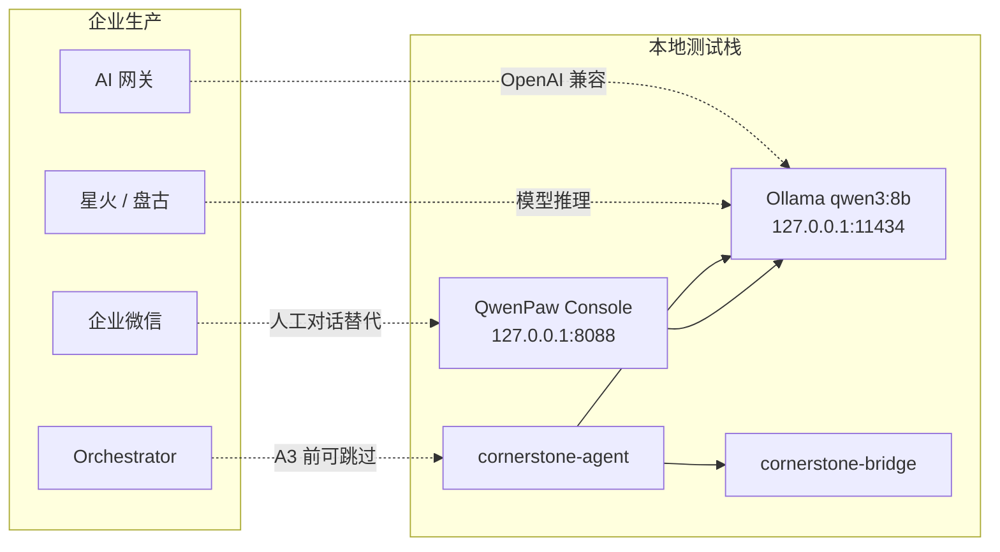

# 本地开发测试：QwenPaw + Ollama 替代企业模型

本文档说明在**无讯飞星火 / 华为盘古 / Orchestrator / 企业微信**的前提下，如何用本机 **QwenPaw** 与 **Ollama** 验证 CornerstoneAgent 的 LLM 协作链路。与 [ENTERPRISE.md](ENTERPRISE.md) 互补：企业生产走网关与编排服务；本地开发走本文档。

实现状态：Agent 代码尚未启动（A0）；Bridge 与 Web 可先独立运行，LLM 部分可按 §4 手工冒烟。

---

## 1. 本机服务一览

| 组件 | 地址 | 鉴权 | 说明 |
|------|------|------|------|
| **cornerstone-bridge** | `http://127.0.0.1:8081` | 无（内网） | 仪器 REST；Agent 唯一数据面 |
| **cornerstone-web** | `http://127.0.0.1:8080` | 无 | 静态 SPA + `/api/*` 反代 Bridge |
| **QwenPaw**（直连） | `http://127.0.0.1:8088` | **免登录** | 进程 `--host 127.0.0.1`；开发首选 |
| **QwenPaw**（Caddy 入口） | `http://192.168.1.97:8088`、`http://wow.tempcy.cn:8088` | **需登录** | Caddy 反代；见 §3 |
| **Ollama** | `http://127.0.0.1:11434` | 无 | 本地推理；已部署 `qwen3:8b`、`qwen3:4b` |

启动 Bridge + Web（仓库根目录惯例）：

```bash
cd CornerstoneWeb
python3 -m cornerstone_web.dev_web
```

需 CWD 存在 `cornerstone-web.config.json`（可从 `cornerstone-web.config.example.json` 复制）。无真实仪器时 Bridge 会记录上游连接失败，REST 与 Web UI 仍可用。

---

## 2. 与企业架构的映射



| 企业组件 | 本地替代 | 用途 |
|----------|----------|------|
| 星火 / 盘古 | **Ollama `qwen3:8b`** | Agent / 脚本程序化调用 LLM |
| AI 网关 | **直连 Ollama** `http://127.0.0.1:11434/v1` | 无密钥、OpenAI 兼容 `chat/completions` |
| Orchestrator | **暂不部署** | A3 阶段 Agent 可直连 LLM；E2+ tool calling 再补最小编排 |
| 企业微信 | **QwenPaw Console** | 人工多轮对话、Skills、话术验证 |

**重要**：QwenPaw 的 `8088` 端口是 **Web Console**，不是 OpenAI API 网关。访问 `/v1/models` 会回落到 SPA；程序化 LLM 调用应走 **Ollama**，不要对 `127.0.0.1:8088` 发 `chat/completions`。

---

## 3. QwenPaw、Caddy 与鉴权

### 3.1 实际拓扑

本机（`192.168.1.97`）上两层服务：

```
浏览器 / 外网
    │
    ├─ http://127.0.0.1:8088 ──────────► QwenPaw（python，仅 loopback）
    │
    └─ http://192.168.1.97:8088 ──┐
       http://wow.tempcy.cn:8088 ─┤
                                  ▼
                            Caddy（192.168.1.97:8088）
                                  │ reverse_proxy
                                  ▼
                            QwenPaw（127.0.0.1:8088）
```

- **QwenPaw 进程**：`python -m qwenpaw app --host 127.0.0.1 --port 8088`
- **Caddy 配置**：`C:\Caddy\Caddyfile`（路由器 `8088` 端口转发到本机 `192.168.1.97:8088`）
- **Ollama**：同机 `127.0.0.1:11434`；QwenPaw Console → **Settings → Models → Ollama**，模型 ID `qwen3:8b`

**Caddyfile 要点**（域名与内网 IP 须在同一 site 块，否则外网 API 会空响应）：

```caddy
http://192.168.1.97:8088, http://wow.tempcy.cn:8088 {
	bind 192.168.1.97
	reverse_proxy 127.0.0.1:8088 {
		header_up Host {host}
		header_up X-Real-IP {remote_host}
	}
}
```

### 3.2 鉴权策略（已启用 `QWENPAW_AUTH_ENABLED`）

QwenPaw 按**客户端 IP** 决定是否跳过登录（配置项 `security.allow_no_auth_hosts`，默认仅 `127.0.0.1` / `::1`）。

| 访问方式 | 客户端 IP 判定 | API 鉴权 |
|----------|----------------|----------|
| `http://127.0.0.1:8088` 直连 | `127.0.0.1` | **免登录** |
| `http://192.168.1.97:8088` 经 Caddy | `X-Real-IP` → 局域网 IP | **需登录** |
| `http://wow.tempcy.cn:8088` 外网 | `X-Real-IP` → 公网 IP | **需登录** |

经 Caddy 访问时，未登录 API 返回 `401 {"detail":"Not authenticated"}` 属**正常现象**；在 Console 完成登录后即可加载 Ollama 模型列表。

本地开发建议：

- **日常调试**：用 `http://127.0.0.1:8088`（免登录）
- **外网 / 局域网验证**：用域名或 `192.168.1.97`，先登录

**不推荐**把局域网 IP 加入 `allow_no_auth_hosts`（等效对整网段免鉴权）。若确需调整，编辑 QwenPaw 工作目录下的 `config.json` → `security.allow_no_auth_hosts`，修改后重启 QwenPaw。

### 3.3 Agent 与 Ollama

- **cornerstone-agent** 与脚本应 **直连** `http://127.0.0.1:11434/v1`，不经过 QwenPaw / Caddy。
- QwenPaw 的 `8088` 是 **Web Console**，不是 OpenAI API 网关；勿对其发 `chat/completions`。

---

## 4. Agent 配置草案（A3 起）

与 [AGENT.md](AGENT.md) §3.3 `llm` 块及 [ENTERPRISE.md](ENTERPRISE.md) §6 对齐，本地开发 Overrides：

**`cornerstone-agent.config.toml`（本地片段）**

```toml
[bridge]
base_url = "http://127.0.0.1:8081"

[llm]
enabled = true
mode = "gateway"                    # 非 orchestrator；直连 OpenAI 兼容端点
base_url = "http://127.0.0.1:11434/v1"
model = "qwen3:8b"
api_key_env = ""                    # Ollama 本机无需 key；留空或任意占位
timeout_s = 120
think = false                       # qwen3 专用：避免 content 为空、reasoning 占满 token

# 本地不启用企业编排（E2 前）
# [orchestrator]
# base_url = ...
```

| 键 | 本地值 | 说明 |
|----|--------|------|
| `llm.mode` | `gateway` | 对应 ENTERPRISE 模式 B：Agent 直连网关；此处网关即 Ollama |
| `llm.base_url` | `http://127.0.0.1:11434/v1` | Ollama OpenAI 兼容前缀 |
| `llm.model` | `qwen3:8b` | 也可用 `qwen3:4b` 加快迭代 |
| `llm.think` | `false` | 实现 `LlmClient` 时写入请求体；见 §5 |

---

## 5. qwen3 与 thinking 模式

Ollama 上的 **qwen3** 系列默认可能进入 thinking：OpenAI 兼容响应里 `choices[0].message.content` 为空，推理文本在 `reasoning` 字段。

Agent 与脚本约定：

1. 请求体始终带 `"think": false`（Ollama 扩展字段，OpenAI 兼容端点支持）。
2. 若仍无 `content`，检查 `max_tokens` 是否过小（thinking 会占满配额）。
3. 备选：调用 Ollama 原生 `POST /api/chat`，同样传 `"think": false`。

---

## 6. 连通性验证

### 6.1 Bridge

```bash
curl.exe -s http://127.0.0.1:8081/api/status
```

### 6.2 Ollama 模型列表

```bash
curl.exe -s http://127.0.0.1:11434/api/tags
```

应看到 `qwen3:8b`（及可选 `qwen3:4b`）。

### 6.3 LLM 对话（Python 3，无第三方依赖）

```python
import json
import urllib.request

body = {
    "model": "qwen3:8b",
    "messages": [{"role": "user", "content": "仪器漏气检查失败，列举三条可能原因。"}],
    "stream": False,
    "think": False,
    "max_tokens": 512,
}
req = urllib.request.Request(
    "http://127.0.0.1:11434/v1/chat/completions",
    data=json.dumps(body).encode(),
    headers={"Content-Type": "application/json"},
)
resp = json.loads(urllib.request.urlopen(req, timeout=120).read())
print(resp["choices"][0]["message"]["content"])
```

### 6.4 QwenPaw Console

- **免登录**：`http://127.0.0.1:8088/`
- **需登录**：`http://192.168.1.97:8088/` 或 `http://wow.tempcy.cn:8088/`

在对话中粘贴 Bridge 返回的 `status` / `system-parameters` JSON，人工验证排故话术。

### 6.5 Bridge + LLM 手工闭环（POC）

```python
import json
import urllib.request

bridge = json.loads(
    urllib.request.urlopen("http://127.0.0.1:8081/api/status", timeout=10).read()
)
prompt = (
    "你是 Cornerstone 仪器顾问。根据以下 JSON 状态，用中文给出简短维护建议：\n"
    + json.dumps(bridge, ensure_ascii=False)[:4000]
)
body = {
    "model": "qwen3:8b",
    "messages": [{"role": "user", "content": prompt}],
    "stream": False,
    "think": False,
    "max_tokens": 512,
}
req = urllib.request.Request(
    "http://127.0.0.1:11434/v1/chat/completions",
    data=json.dumps(body).encode(),
    headers={"Content-Type": "application/json"},
)
print(json.loads(urllib.request.urlopen(req, timeout=120).read())["choices"][0]["message"]["content"])
```

---

## 7. 分阶段测试路径

| 阶段 | 依赖 LLM | 本地做法 |
|------|----------|----------|
| **A1–A2** | 否 | Bridge 采集 + 规则引擎；`llm.enabled = false` |
| **A3** | 是 | `LlmClient` 指向 Ollama；信息窗口 / `ask` 子命令 |
| **A4** | 是 | 短期采集包 + 日志 tail + UI inspect → 同一 Ollama 端点 |
| **E1–E2**（可选） | 是 | 最小 Orchestrator 仍可将 `models.toml` 默认路由到 Ollama，代替 spark/pangu |

原则不变（见 AGENT.md）：**LLM 不直连仪器**；所有仪器数据经 Agent → Bridge；本地 Ollama 仅接收脱敏后的结构化上下文。

---

## 8. 常见问题

**Q：外网打开 wow.tempcy.cn 没有模型 / API 401？**  
A：Caddy 已转发时，401 表示需登录（仅 `127.0.0.1` 免鉴权）。登录后应正常；若仍无模型，检查 Caddyfile 是否包含 `wow.tempcy.cn`（见 §3.1）。

**Q：能否让 Agent 调用 QwenPaw 的 8088？**  
A：不能作为 OpenAI API。8088 是 Console；Agent 用 Ollama。

**Q：无仪器时如何测？**  
A：Bridge 离线字段仍可返回；或用历史 `acquisition-snapshot` JSON 直接喂给 Ollama / QwenPaw 对话。

**Q：Windows 上 `curl` 报错？**  
A：PowerShell 中 `curl` 是 `Invoke-WebRequest` 别名；请用 `curl.exe` 或上文 Python 片段。

**Q：与 ENTERPRISE.md 的 `llm.mode = orchestrator` 冲突吗？**  
A：不冲突。本地固定 `mode = gateway` + Ollama；上线后改为 `orchestrator` 并移除边缘 `base_url` 即可。

---

## 9. 相关文档

- 架构与 A0–A5：[AGENT.md](AGENT.md)
- 企业生产（星火/盘古/微信）：[ENTERPRISE.md](ENTERPRISE.md)
- 仓库里程碑：[../PLAN.md](../PLAN.md) §3

---

*文档版本：2026-07。本机：QwenPaw @ 127.0.0.1:8088（仅 loopback 免鉴权），Caddy @ 192.168.1.97:8088 + wow.tempcy.cn:8088，Ollama qwen3:8b @ 127.0.0.1:11434。*
