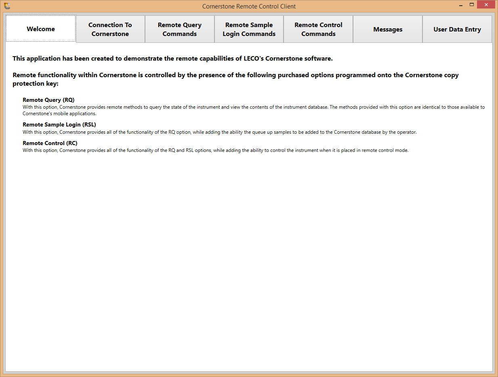
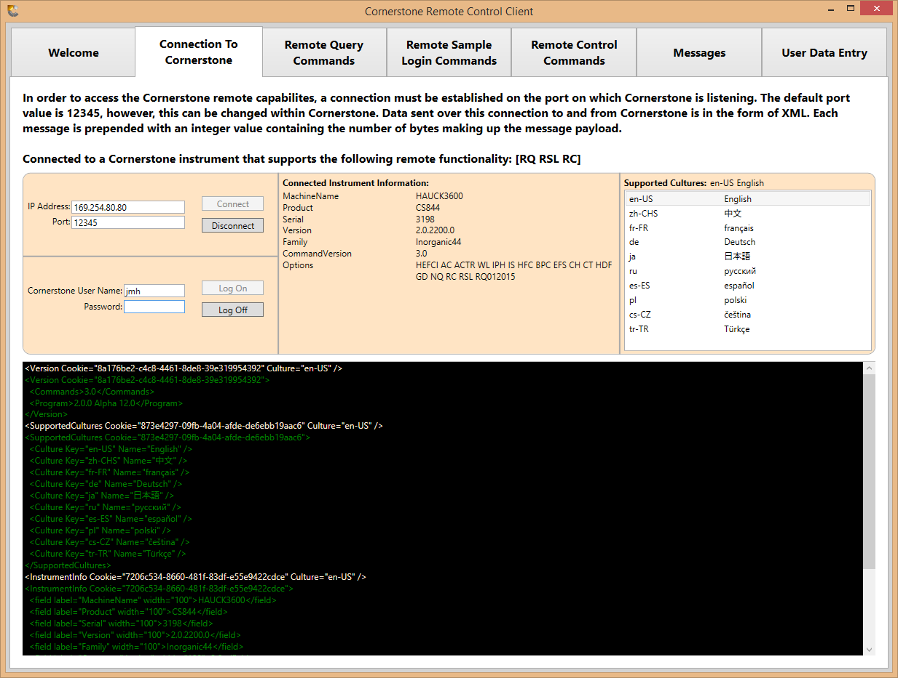
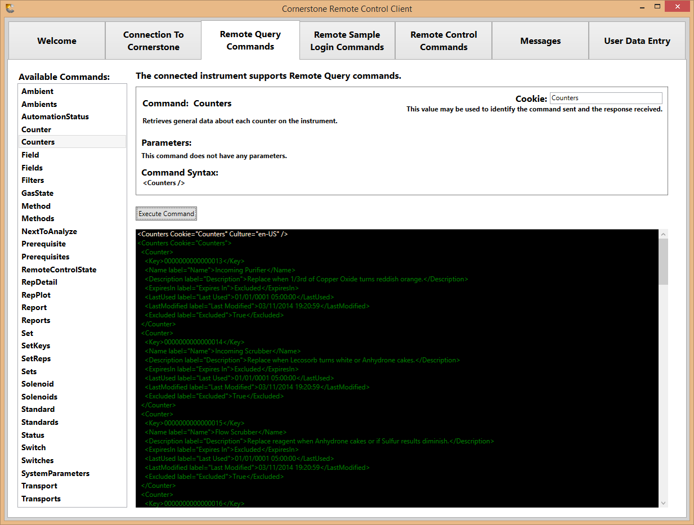
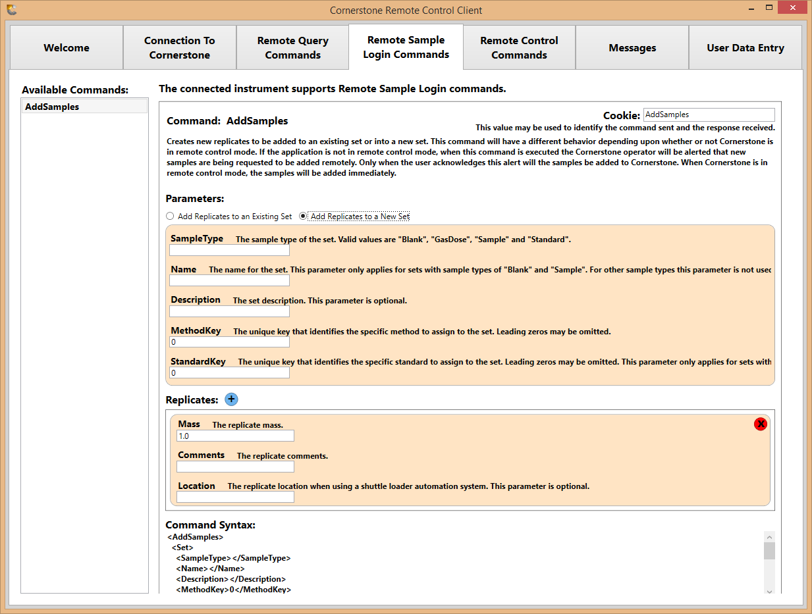
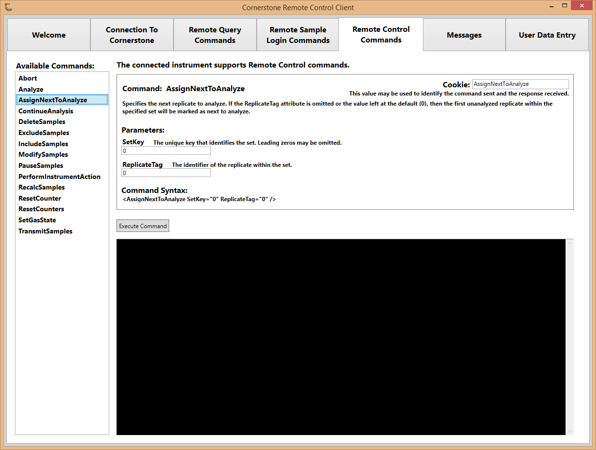
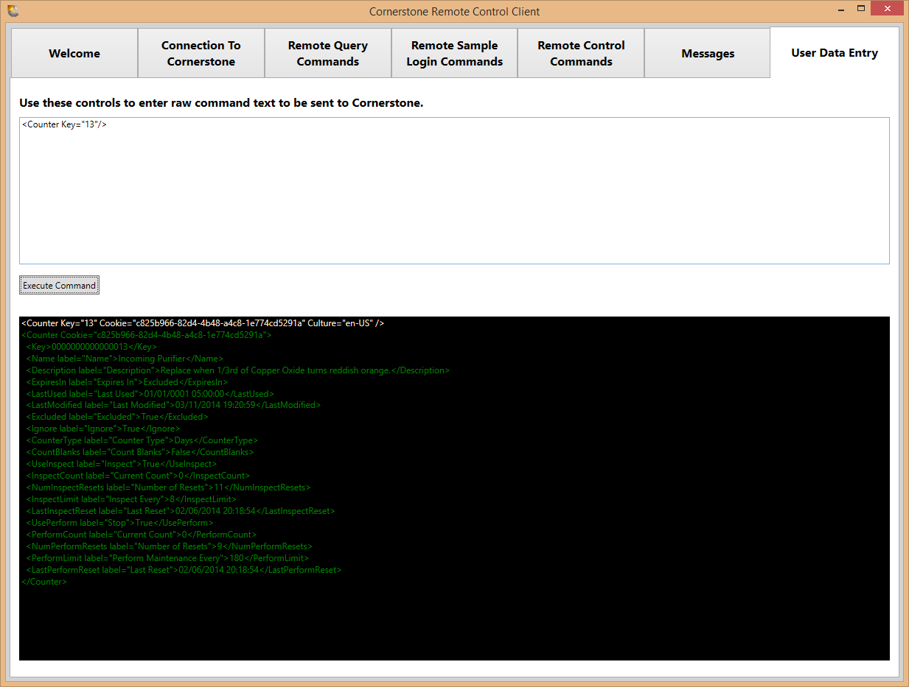

# LECO Cornerstone&reg; remote control sample application

[](https://dev.azure.com/lecord/Public/_build/latest?definitionId=105&branchName=master)

A demo of connecting to a LECO Cornerstone instrument using the purchased remote control options of the instrument's
copy protection key.

## Run this application

You can either run the latest build, or else run directly from the source code.

### Run the latest build

Download the latest build:
1. [Navigate to the latest build](https://dev.azure.com/lecord/Public/_build/latest?definitionId=105&branchName=master)
1. Click on "1 published" under Summary > Related

   
1. Open the "three dots" menu and choose "Download artifacts"

   
1. Extract the contents of that zip file and run "CornerstoneRemoteControlClient.exe"

### Run from source code

1. Install .NET 7 SDK:<br/>
   https://dotnet.microsoft.com/en-us/download
1. Download [the source code for this project](https://dev.azure.com/lecord/47d81506-51bb-48e2-b5c0-665a2f876afe/_apis/git/repositories/44d8b8f5-ac22-4517-b9fd-ba503ae64ec0/items?path=/&versionDescriptor%5BversionOptions%5D=0&versionDescriptor%5BversionType%5D=0&versionDescriptor%5Bversion%5D=master&resolveLfs=true&%24format=zip&api-version=5.0&download=true)
1. Run this command:
   ```
   dotnet run --project CornerstoneRemoteControlClient
   ```

## Build this application

Install .NET 7 SDK:<br/>
https://dotnet.microsoft.com/en-us/download

Then run this command:
```
dotnet publish -r win-x86 -p:PublishSingleFile=true --self-contained true -o publish -c Release
```

## Protocol documentation

* [General documentation](docs/Remote%20Control.docx)
* [GDS specific](docs/GDS%20Remote%20Control.docx)

## Application screenshots











