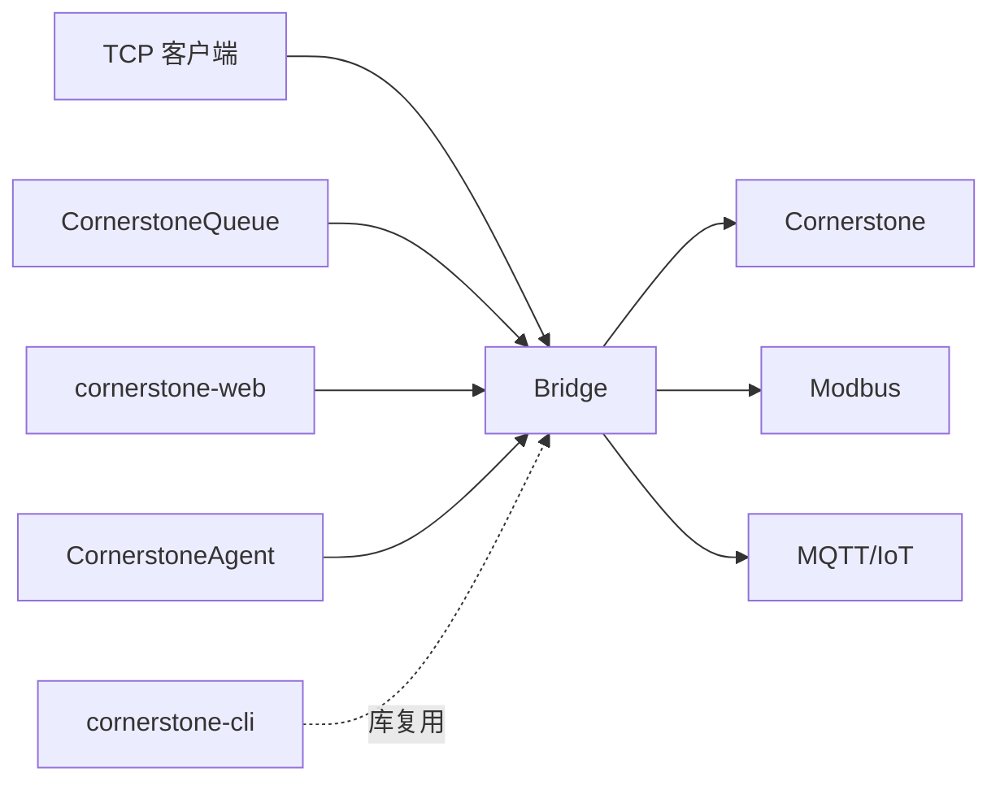
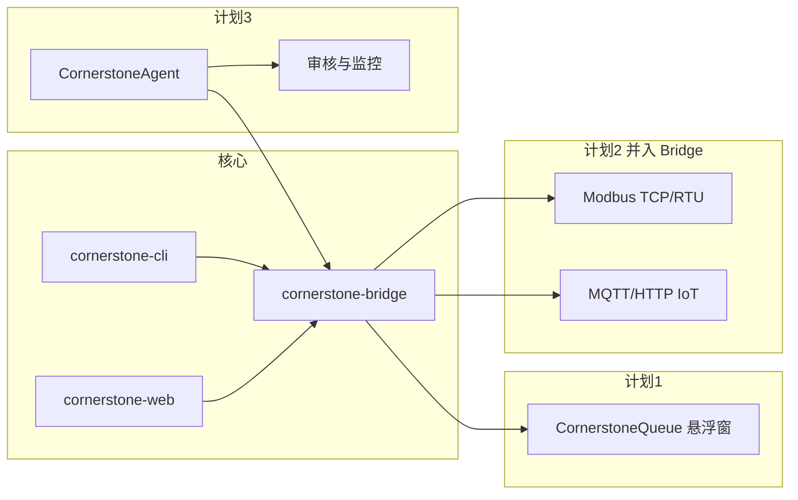

# CornerstoneWeb 后续开发计划

基于当前仓库（`cornerstone-cli` + `cornerstone-bridge` + `cornerstone-web` + `CornerstoneQueue`），分三条产品线规划、分阶段落地。

### 进度快照（2026-05）


| 组件                   | 阶段    | 状态                                                                     |
| -------------------- | ----- | ---------------------------------------------------------------------- |
| Bridge / Web         | 0–1   | ✅ 分包、独立进程、配置拆分为 `cornerstone-bridge.config.toml` + `cornerstone-web.config.toml`（兼容旧 `.json`） |
| **Bridge 控制台**       | —     | ✅ `cornerstone-bridge-ui`：托盘、配置/日志（级别筛选、智能滚动）、连接/队列监控、服务启停 |
| **Web 分析页谱图**        | —     | ✅ RepPlot 曲线改用 ECharts（`web_static/echarts.min.js`） |
| **CornerstoneQueue** | M1–M3 + 仪器 UI 自动点击 | ✅ 见下文 §1（发送成功后可选 FlaUI 点击确认；**不**做系统通知/全局快捷键） |
| Bridge 北向            | P2+   | ⏳ Modbus/MQTT                                                          |
| CornerstoneAgent     | A1+   | ⏳ 未启动                                                                  |


**已确定架构**：**Bridge = 网关 + 协议适配（Modbus / IoT，阶段 2）**；`**cornerstone-web`** 仅静态 SPA + `/api/`* 反向代理，不持有 `GatewayHub` 或仪器会话。

---

## 架构决策（仓库边界）

### 已实现运行时架构（阶段 0–1 ✅）

```mermaid
flowchart TB
  subgraph clients [客户端]
    TCP[TCP 远程客户端]
    Browser[浏览器]
    Queue[CornerstoneQueue 悬浮窗]
  end
  subgraph web [cornerstone-web : web_port]
    SPA[web_static / index.html]
    PROXY[/api/* 反向代理]
  end
  subgraph bridge [cornerstone-bridge]
    GW[TCP 网关 gateway.py]
    HUB[GatewayHub hub.py]
    API[REST http_api.py]
    PARSE[parsers.py]
  end
  CS[Cornerstone 仪器]
  TCP --> GW
  Browser --> SPA
  Queue --> API
  SPA --> PROXY
  PROXY --> API
  GW --> HUB
  API --> HUB
  HUB --> CS
  PARSE --> HUB
```


| 监听（示例配置）                                              | 进程     | 说明                            |
| ----------------------------------------------------- | ------ | ----------------------------- |
| `host:port`（如 `0.0.0.0:54321`）                        | Bridge | C# / CLI 远程客户端连此 TCP 网关       |
| `bridge_api_host:bridge_api_port`（如 `127.0.0.1:8081`） | Bridge | 对内 REST；悬浮窗 / 脚本应连此地址         |
| `web_host:web_port`（如 `127.0.0.1:8080`）               | Web    | 浏览器访问；`/api/*` 代理到 Bridge API |


**Bridge 包内模块**（`CornerstoneBridge/src/cornerstone_bridge/`）：`protocol.py`、`parsers.py`、`hub.py`、`hub_helpers.py`、`hub_types.py`、`gateway.py`、`http_api.py`、`server.py`、`config.py`、`bridge_logging.py`；桌面控制台 `ui/`（`cornerstone-bridge-ui`）。

**Web 包**（`CornerstoneWeb/src/cornerstone_web/`）：`web_static/`（含 `echarts.min.js` 分析页谱图）、`http_server.py`（静态 + 代理）、`server.py`、`dev_web.py`（`cornerstone-web-dev` 同进程拉起 Bridge + Web，转发 Bridge 全部配置项含 `upstream_inner_reassembly_timeout`）。

### 目标架构




| 组件                     | 职责                                                                                                                   |
| ---------------------- | -------------------------------------------------------------------------------------------------------------------- |
| **cornerstone-cli**    | 协议帧、TCP 引擎、可选 CLI；**共享库**，不单独跑网关                                                                                     |
| **cornerstone-bridge** | 上游 TCP 网关、AddSamples 队列、`instrument_rq`、**XML→JSON 解析**、对内 REST；上游 inner 帧跨 TCP 分段拼接（`upstream_inner_reassembly_timeout`）；TCP 客户端 `Logon`/`Logoff` 合成应答；**北向** Modbus/MQTT（Gateway + Protocol Adapters，可同进程） |
| **cornerstone-web**    | 静态资源 + 薄 BFF（或纯静态直连 Bridge API）；**不再** `import GatewayHub`                                                           |
| **cornerstone-queue**  | 桌面悬浮窗，仅 HTTP 客户端                                                                                                     |
| **cornerstone-agent**  | 规则/AI、监控，调 Bridge API 或 `cornerstone_cli`                                                                            |


**开发/仿真**：保留 `**cornerstone-web-dev` = Bridge + Web 一键启动**（与现有一键体验一致）。  
**生产**：可只部署 **Bridge**；Web 可为 Nginx 静态 + Bridge API。

### 实施顺序（不必一步拆光）


| 阶段       | 内容                                                                                                                                   |
| -------- | ------------------------------------------------------------------------------------------------------------------------------------ |
| **0** ✅  | 仓内逻辑分包：`cornerstone_bridge` 下 `protocol.py` / `parsers.py` / `http_api.py` / `hub.py` / `gateway.py`                                 |
| **1** ✅  | `cornerstone-bridge` / `cornerstone-web` 独立进程；配置拆为 `cornerstone-bridge.config.toml` + `cornerstone-web.config.toml`（兼容 `.json`）；`cornerstone-web-dev` 一键启动 |
| **1b** ✅ | `CornerstoneQueue` 悬浮窗 M1–M3 + 仪器 UI 自动点击（WinUI 3，HTTP 调 Bridge REST）                                                                  |
| **2**    | Bridge 增加 Modbus/MQTT（映射与 `instrument_rq` 读数共用）                                                                                      |
| **3**    | Agent 只依赖 Bridge API；不再碰 TCP Cookie                                                                                                  |


### Bridge 第一版 REST（与现有 `/api/`* 对齐）

Bridge 至少提供：

- `GET/POST /api/queue`、`/api/status`、`/api/config`、`PUT /api/settings`  
- `GET /api/instrument/`*、`/api/settings/*`、`/api/diagnostic/*`、`/api/environment/*`  
- 可选：原始 **TCP 代理端口**（与现在 `host:port` 一致），供 C# 客户端继续连 Bridge

**解析器归属**：放 **Bridge**（Web 只渲染 JSON）；Bridge 仅透传 XML 会导致 Web/Agent/Queue 重复解析，**不推荐**。

---

## 总览（三条产品线）


| 序号  | 方向         | 定位                       | 与仓库关系                                                             |
| --- | ---------- | ------------------------ | ----------------------------------------------------------------- |
| 1   | 缓存样品悬浮窗    | 轻量桌面端，专注队列查看与「发送至仪器」     | `**CornerstoneQueue/`**（WinUI 3）；消费 Bridge `GET/POST /api/queue`* |
| 2   | 协议转换网关     | 厂家私有协议 ↔ Modbus / 通用 IoT | **即 cornerstone-bridge**（南向 TCP/XML + 北向 Modbus/MQTT）             |
| 3   | 仪器本机 Agent | 驻场采集 + 规则/AI 审核与告警       | 连 **Bridge 对内 API** 或 `cornerstone-cli`；不嵌套网关                     |





目录命名与 PLAN 一致：`**CornerstoneQueue**`（勿用 `CornetstoneQueue`）、`**CornerstoneBridge**`、`**CornerstoneAgent**`。

---

## 1. 缓存样品指令悬浮窗（独立程序）

### 目标

- 常驻桌面、可置顶的小窗，**只负责** Bridge 截留的 `AddSamples` 队列：列表、勾选、发送至仪器、刷新。
- 不替代完整 Web 分析页，缩短操作路径（实验员多屏/全屏 Cornerstone 时仍能看到队列）。

### 数据来源


| API                    | 用途                                             |
| ---------------------- | ---------------------------------------------- |
| `GET /api/queue`       | 列表：`id`、`sampleName`、`sampleDescription`、时间、来源 |
| `POST /api/queue/send` | `{"ids":[...]}`，发送后**保留**队列（`queueKept: true`） |
| `GET /api/status`（可选）  | `businessOnline`、失败计数、队列、RemoteControl 状态                  |


配置：Bridge REST 基址 `**http://<bridge_api_host>:<bridge_api_port>`**（示例 `http://127.0.0.1:8081`）。勿与 Web 页端口 `web_port`（8080）混淆。

### 技术栈

- **WinUI 3**（Windows App SDK）：与现有 C# 客户端技能栈一致；目标平台 Windows 10 1809+ / Windows 11。
- 托盘图标 + 可拖拽悬浮窗；列顺序与 Web 对齐：**样品名称 → 样品说明**。

### 阶段划分


| 阶段         | 内容                                 | 验收               | 状态  |
| ---------- | ---------------------------------- | ---------------- | --- |
| **M1**     | 只读：轮询/手动刷新队列，展示连接状态                | 与 Web 队列数据一致     | ✅   |
| **M2**     | 多选 +「发送至仪器」+ 结果提示（成功/上游 XML 摘要）    | 行为与 Web「发送至仪器」一致 | ✅   |
| **M3**     | 设置页（Bridge URL、刷新间隔、窗口置顶/透明度）；断线重连 | 7×24 挂机可用        | ✅   |
| **仪器 UI 自动点击** | 发送成功后可选点击 Cornerstone 消息/添加试样（FlaUI；设置内 Inspect/测试） | 与 Web 发送行为一致时可减少手工确认 | ✅   |


### 已实现要点（`CornerstoneQueue/`）

- **技术**：WinUI 3（Windows App SDK 1.6）、`net8.0-windows10.0.19041.0`、x64；`WindowsAppSDKSelfContained` 便于未预装运行时的本机部署。
- **API**：`GET /api/queue`、`POST /api/queue/send`、`GET /api/status`、`GET /api/config`；默认 Bridge `http://127.0.0.1:8081`（设置可改）。
- **UI**：顶栏单行状态、列表每试样一行（`样品名 → 说明`）、底栏单行发送结果；队列指纹未变时不刷新列表（防闪烁）。
- **M3 设置**：`%LocalAppData%\CornerstoneQueue\settings.json` — Bridge 基址、状态/队列轮询秒数、置顶、透明度、字号与窗体缩放、断线重连间隔；仪器 UI 自动点击相关项见上。
- **增强（超出原 M3 文案）**：屏幕边缘拖放收纳（上侧滑出屏外，左右侧细条唤回）；禁用系统贴靠布局干扰（`SystemSnapDisabler`）。
- **仪器 UI 自动点击（✅）**：`InstrumentUiAutomationService`（FlaUI UIA3）；设置中开关「发送后自动点击仪器 UI」、窗口标题/AutomationId、步骤延时；**Inspect 检查控件** / **测试点击**（`InstrumentUiInspectWindow`）。默认关闭，因仪器版本与分辨率差异需现场校准。
- **明确不做**：Windows **系统通知**（发送失败、队列满 Toast）、**全局快捷键**唤起悬浮窗——已从路线图移除，不再开发。
- **构建**：`CornerstoneQueue.sln`，Visual Studio 2026/2022；说明见根目录 [README.md](README.md#cornerstonequeue缓存样品悬浮窗)。

### 风险与约束

- Bridge 未对 TCP 客户端做鉴权时，悬浮窗应仅连**内网**。
- 若未配置网页账号（`web_user` / `web_password`），发送会失败，需在 UI 明确提示（状态栏/发送结果已提示）。
- **仪器桌面确认**：协议 `ErrorCode=0` 后本机 UI 仍可能需确认；可在设置中启用 **自动点击仪器 UI**（脆弱，依赖 AutomationId/控件树）。仍建议优先查仪器 RSL 免确认；失败时查看发送结果栏中的「UI 点击」摘要。

---

## 2. 协议转换（Bridge：网关 + Modbus / IoT）

### 目标

- **Bridge** 统一承担：
  - **南向**：Cornerstone 远程控制 XML/TCP（网关、会话、`instrument_rq`、XML→JSON）；
  - **北向**：Modbus 寄存器/线圈、MQTT/HTTP JSON（主题/点位可配置）。
- 不再与 Web 混在同一进程职责中；Web 仅展示与编排。

### 架构

```
[Cornerstone 仪器] ←TCP/XML→ [cornerstone-bridge] → Modbus Slave / MQTT Broker
                              ↑
                    [映射配置 YAML/JSON]
                    [cornerstone_cli 通信复用]
         [cornerstone-web] ──HTTP──→ Bridge REST
         [CornerstoneQueue] ──HTTP──→ Bridge REST
```

**核心模块（Bridge 内）**

1. **Gateway**（`gateway.py`）：多客户端 TCP、上游单连接、AddSamples 队列、Cookie 路由；`Logon`/`Logoff` 合成应答（网关已持上游会话时）。
2. **解析与对内 REST**（`parsers.py` + `http_api.py`）：`_parse_`* → JSON；队列、status、instrument/* 等 API。
3. **映射引擎**：配置驱动——JSON 字段 → Modbus 地址 / MQTT topic。
4. **北向出口**：Modbus TCP Server（如 pymodbus）；MQTT：`instrument/{id}/status`、`/queue/count`、`/alarm/...`。
5. **管理面**：健康检查、最后成功时间、映射热加载（可选）。

### 阶段划分


| 阶段       | 内容                                                   | 验收               |
| -------- | ---------------------------------------------------- | ---------------- |
| **P0** ✅ | 仓内模块化（`cornerstone_bridge` 分包）                       | 已完成              |
| **P1** ✅ | `cornerstone-bridge` 独立进程 + REST；Web 代理 `/api/`*     | 已完成              |
| **P2**   | 只读映射：`Status`、`RemoteControlState`、队列 `queueCurrent` | Modbus + MQTT 可读 |
| **P3**   | 扩展：`Ambients`、`Counters`；文档化寄存器表                     | 与仪器/Web 读数一致     |
| **P4**   | 写侧（谨慎）：白名单 RC / Modbus 触发刷新                          | 权限与互锁            |
| **P5**   | 第二厂家协议插件（`SouthboundAdapter`）                        | 插件接入             |


### 与 CLI / Web 的分工

- **开发期**：`cornerstone-web-dev` 一键起 Bridge + Web；无仪器时用 Bridge 联调。
- **生产期**：Bridge 贴仪器工控机；Web 可放办公网，仅调 Bridge REST。

### 交付物

- Python 包 `**cornerstone-bridge`**；
- 《Modbus 点表》+《MQTT 主题规范》+ 示例 Node-RED / ThingsBoard 接入。

---

## 3. 仪器本机 Agent（AI 数据审核 + 状态监控）

### 目标

- 部署在**仪器工控机或边缘盒子**上的常驻 Agent：
  - **监控**：连接状态、关键 `Status`/环境/漏气/系统检查、队列与 Sets 异常；
  - **审核**：对 Set/Replicate 结果、QC、谱图/统计做规则 + AI 辅助判断（通过/复核/驳回建议）；
  - **上报**：告警与审核结论推送到 IoT/企业消息（经 Bridge 的 MQTT 或独立 Webhook）。

### 架构建议

```
[仪器] ←→ [Bridge]
              ↑
         [本机 Agent]
              ├─ 采集调度（Bridge REST / 可选 cornerstone_cli）
              ├─ 规则引擎（阈值、连续失败、维护到期）
              ├─ AI 模块（可选：本地小模型 / 云端 API）
              └─ 输出 → MQTT / 日志 / 本地 SQLite 审计库
```

### 阶段划分


| 阶段     | 内容                                                | 验收           |
| ------ | ------------------------------------------------- | ------------ |
| **A1** | 无 AI：定时拉 `Status` + status-check 等价数据，规则告警        | 告警可配置、可静默    |
| **A2** | 数据审核 v1：`SetReps` / `set-stats`，规则判断（RSD、空白、n 不足） | 结构化审核报告 JSON |
| **A3** | AI 增强：RepDetail/统计摘要送 LLM（脱敏、可关闭）                 | 人工可覆盖、全量留痕   |
| **A4** | 与 Web/悬浮窗联动：远程录入 Sets 后自动审核流水线                    | 端到端闭环        |
| **A5** | 运维：自更新配置、健康心跳、离线缓存                                | 适合长期驻场       |


### AI 设计原则（建议写进规范）

- **默认规则优先、AI 建议为辅**，避免自动改仪器参数。
- 输入仅结构化字段 + 脱敏谱图统计，不上传原始客户样品标识（可配置）。
- 所有结论带 `ruleId` / `modelVersion` / `timestamp`，便于追溯。

### 与计划 1、2 的协同

- Agent 通过 **Bridge REST** 调试审核逻辑（实验室与生产同一 API 面）。
- 审核结果、监控指标经 **Bridge 北向** 发布到 Modbus/IoT，供 MES/大屏使用。
- 悬浮窗负责**人工发送样品**；Agent 负责**发送后/分析后的自动盯盘**。

---

## 推荐实施顺序与资源粗估


| 优先级    | 项目                            | 理由                   | 粗估（1 人） |
| ------ | ----------------------------- | -------------------- | ------- |
| **高**  | 1 悬浮窗 M1–M3 + UI 自动点击        | 已落地；产线校准与硬化待定     | —       |
| **中**  | 2 Bridge P2–P3（Modbus/MQTT）   | 打通 OT/IT             | 4–6 周   |
| **中高** | 3 Agent A1–A2                 | 规则审核不依赖 AI           | 3–4 周   |
| **后续** | 3 A3 AI、2 P4 写 Modbus、Queue 产线硬化 | 安全与合规评审              | 各 2–4 周 |


### 建议里程碑

1. **Q1 末**：~~悬浮窗 beta~~ **悬浮窗 M1–M3 与仪器 UI 自动点击已可用**；Bridge/Web 配置拆分已完成；Web 分析页 RepPlot 已切 ECharts；后续产线反馈与安装包迭代。
2. **Q2 中**：Modbus/MQTT 只读点表 v1 + Agent 规则监控试点。
3. **Q2 末**：Agent 审核报告 v1 + AI 可选 POC。
4. **Q3**：多厂家适配插件、生产硬化（鉴权、TLS、审计）。

---

## 仓库与文档建议


| 目录/包                                       | 说明                                                                                              |
| ------------------------------------------ | ----------------------------------------------------------------------------------------------- |
| `CornerstoneCLI` / `cornerstone-cli`       | 共享协议库                                                                                           |
| `CornerstoneBridge` / `cornerstone-bridge` | 网关 + 解析 + REST（`cornerstone-bridge`）；`cornerstone-bridge-ui` 桌面控制台；后续 Modbus/MQTT |
| `CornerstoneWeb` / `**cornerstone-web`**   | 静态 UI + 可选 BFF；`web_static` 含 ECharts；入口 `cornerstone-web`、`cornerstone-web-dev`                                       |
| `CornerstoneQueue`                         | WinUI 3 悬浮窗（M1–M3 + 可选 UI 自动点击 ✅）；`CornerstoneQueue.sln`；设置见 `%LocalAppData%\CornerstoneQueue\settings.json` |
| `installer/`                               | PyInstaller + Inno Setup：Bridge 必选，Web/Queue/CLI/Bridge 控制台可选；Bridge/Web 可注册系统服务（默认全选） |
| `CornerstoneAgent`                         | 边缘 Agent                                                                                        |


- 新程序建议**独立目录**（或后续独立仓库），pip 依赖 `cornerstone-cli` 或 HTTP 调用 Bridge。
- 根目录 `README.md` 链到本文件；集成说明随 Bridge/Web 拆分逐步更新。

---

## 待细化（按需展开）

- 安装包：服务账户权限、升级/覆盖安装策略、Python 运行时与 WinUI 依赖的离线体积优化
- 悬浮窗：仪器 UI 自动点击在不同 Cornerstone 版本上的控件树差异与校准文档
- Bridge：Modbus 寄存器表初稿、MQTT 主题命名规范；REST 与现 `/api/`* 差异清单
- Agent：审核报告 JSON Schema、告警级别与静默策略

