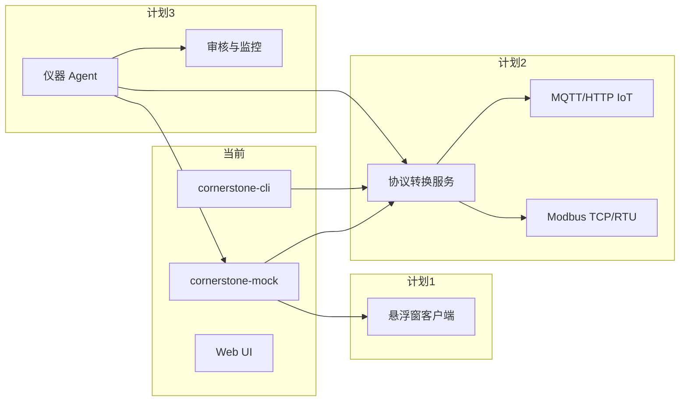

# CornerstoneMock 后续开发计划

基于当前仓库（`cornerstone-cli` + `cornerstone-mock` 网关、样品缓存 REST、Sets/远程录入等能力），分三条产品线规划、分阶段落地。

---

## 总览

| 序号 | 方向 | 定位 | 与现有仓库关系 |
|------|------|------|----------------|
| 1 | 缓存样品悬浮窗 | 轻量桌面端，专注队列查看与「发送至仪器」 | 消费 Mock 已有 `GET/POST /api/queue*` |
| 2 | 协议转换网关 | 厂家私有协议 ↔ Modbus / 通用 IoT | 可复用 CLI 通信层与 XML 语义，新建独立服务 |
| 3 | 仪器本机 Agent | 驻场采集 + 规则/AI 审核与告警 | 上游对接仪器或 Mock；下游对接 IoT/消息总线 |



---

## 1. 缓存样品指令悬浮窗（独立程序）

### 目标

- 常驻桌面、可置顶的小窗，**只负责** Mock 截留的 `AddSamples` 队列：列表、勾选、发送至仪器、刷新。
- 不替代完整 Web 分析页，缩短操作路径（实验员多屏/全屏 Cornerstone 时仍能看到队列）。

### 数据来源（已实现，可直接对接）

| API | 用途 |
|-----|------|
| `GET /api/queue` | 列表：`id`、`sampleName`、`sampleDescription`、时间、来源 |
| `POST /api/queue/send` | `{"ids":[...]}`，发送后**保留**队列（`queueKept: true`） |
| `GET /api/status`（可选） | 网关/上游连接、队列条数、RemoteControl 状态 |

配置：Mock 地址（如 `http://127.0.0.1:8080`），与 `cornerstone-mock.config.example.json` 中 `web_host` / `web_port` 一致。

### 建议技术栈

- **Windows 优先**：WPF / WinUI 3 / Tauri（Rust + WebView）— 与现有 C# 客户端技能栈接近；跨平台可选 Electron / Tauri。
- 托盘图标 + 可拖拽悬浮窗；列顺序与 Web 对齐：**样品名称 → 样品说明**。

### 阶段划分

| 阶段 | 内容 | 验收 |
|------|------|------|
| **M1** | 只读：轮询/手动刷新队列，展示连接状态 | 与 Web 队列数据一致 |
| **M2** | 多选 +「发送至仪器」+ 结果提示（成功/上游 XML 摘要） | 行为与 Web「发送至仪器」一致 |
| **M3** | 设置页（Mock URL、刷新间隔、窗口置顶/透明度）；断线重连 | 7×24 挂机可用 |
| **M4**（可选） | 系统通知（发送失败、队列满）、快捷键全局唤起 | 提升产线体验 |

### 风险与约束

- Mock 未对 TCP 客户端做鉴权，悬浮窗应仅连**内网** Mock。
- 若 Mock 未配置 `--web-user` / `--web-password`，发送会失败，需在 UI 明确提示。

---

## 2. 协议转换程序（厂家接口 → Modbus / IoT）

### 目标

- 将 Cornerstone **远程控制 XML/TCP**（及未来其它厂家私有协议）映射为：
  - **Modbus**：寄存器/线圈表，供 PLC、SCADA、组态软件读写；
  - **通用 IoT**：MQTT（推荐）或 HTTP JSON，主题/点位命名可配置。
- 转换层**不替代** Mock 网关角色：可与 Mock 并联（开发/仿真）或直连仪器（生产）。

### 架构建议

```
[Cornerstone 仪器] ←TCP/XML→ [协议转换服务] → Modbus Slave / MQTT Broker
                              ↑
                    [映射配置 YAML/JSON]
                    [cornerstone_cli 通信复用]
```

**核心模块**

1. **南向适配器**：复用 `cornerstone_cli.communications` 长连接/短连接；订阅或轮询 `Status`、`Ambients`、`Counters`、队列长度等（与 Mock 已解析字段对齐，减少重复造轮子）。
2. **映射引擎**：配置驱动——XML 路径或已解析 JSON 字段 → Modbus 地址 / MQTT topic。
3. **北向出口**：
   - Modbus TCP Server（如 pymodbus）；
   - MQTT：`instrument/{id}/status`、`/queue/count`、`/alarm/...`。
4. **管理面**：健康检查、最后成功时间、映射热加载（可选）。

### 阶段划分

| 阶段 | 内容 | 验收 |
|------|------|------|
| **P1** | 只读映射：`Status`（Analyzing/Ready 等布尔）、`RemoteControlState`、队列 `queueCurrent` | Modbus 表 + MQTT 可读 |
| **P2** | 扩展：`Ambients` 数值、`Counters` 过期标志；文档化寄存器表 | 与仪器/Web 读数一致 |
| **P3** | 写侧（谨慎）：如通过 Modbus 触发「刷新」或转发简单 RQ（需权限与互锁设计） | 仅白名单命令 |
| **P4** | 第二厂家协议插件接口（抽象 `SouthboundAdapter`） | 新协议以插件接入 |

### 与 Mock/CLI 的分工

- **开发期**：转换服务连 Mock 上游或复用 Mock 的 `instrument_rq` 同源逻辑，用 Mock 无仪器联调。
- **生产期**：转换服务直连仪器 TCP；Mock 仍服务多客户端与样品缓存。

### 交付物

- 独立 Python 包（如 `cornerstone-protocol-bridge`）或 C# 服务；
- 《Modbus 点表》+《MQTT 主题规范》+ 示例 Node-RED / ThingsBoard 接入。

---

## 3. 仪器本机 Agent（AI 数据审核 + 状态监控）

### 目标

- 部署在**仪器工控机或边缘盒子**上的常驻 Agent：
  - **监控**：连接状态、关键 `Status`/环境/漏气/系统检查、队列与 Sets 异常；
  - **审核**：对 Set/Replicate 结果、QC、谱图/统计做规则 + AI 辅助判断（通过/复核/驳回建议）；
  - **上报**：告警与审核结论推送到 IoT/企业消息（复用计划 2 的 MQTT 或独立 Webhook）。

### 架构建议

```
[仪器] ←→ [本机 Agent]
              ├─ 采集调度（RQ 轮询 + 事件）
              ├─ 规则引擎（阈值、连续失败、维护到期）
              ├─ AI 模块（可选：本地小模型 / 云端 API）
              └─ 输出 → MQTT / 日志 / 本地 SQLite 审计库
```

### 阶段划分

| 阶段 | 内容 | 验收 |
|------|------|------|
| **A1** | 无 AI：定时拉 `Status` + status-check 等价数据，规则告警（连接断开、NeedsMaintenance、漏气失败） | 告警可配置、可静默 |
| **A2** | 数据审核 v1：对选定 Set 拉 `SetReps` / `set-stats`，规则判断（RSD 超限、空白异常、n 不足） | 生成结构化审核报告 JSON |
| **A3** | AI 增强：将 RepDetail/统计摘要送 LLM（需脱敏与可关闭）；输出「建议复核」及理由 | 人工可覆盖、全量留痕 |
| **A4** | 与 Mock/悬浮窗联动：远程录入 Sets 后自动触发审核流水线 | 端到端演示闭环 |
| **A5** | 运维：自更新配置、健康心跳、离线缓存 | 适合长期驻场 |

### AI 设计原则（建议写进规范）

- **默认规则优先、AI 建议为辅**，避免自动改仪器参数。
- 输入仅结构化字段 + 脱敏谱图统计，不上传原始客户样品标识（可配置）。
- 所有结论带 `ruleId` / `modelVersion` / `timestamp`，便于追溯。

### 与计划 1、2 的协同

- Agent 可通过 **Mock REST** 在实验室环境调试审核逻辑。
- 审核结果、监控指标经 **计划 2** 发布到 Modbus/IoT，供 MES/大屏使用。
- 悬浮窗负责**人工发送样品**；Agent 负责**发送后/分析后的自动盯盘**。

---

## 推荐实施顺序与资源粗估

| 优先级 | 项目 | 理由 | 粗估（1 人） |
|--------|------|------|----------------|
| **高** | 1 悬浮窗 M1–M2 | 复用现有 API，见效快、用户痛点明确 | 2–3 周 |
| **中** | 2 转换 P1–P2 | 打通 OT/IT，依赖映射设计评审 | 4–6 周 |
| **中高** | 3 Agent A1–A2 | 规则审核可先做，不依赖 AI | 3–4 周 |
| **后续** | 3 A3 AI、2 P3 写 Modbus、1 M4 增强 | 需安全与合规评审 | 各 2–4 周 |

### 建议里程碑

1. **Q1 末**：悬浮窗 beta + Mock 队列/status API 稳定。
2. **Q2 中**：Modbus/MQTT 只读点表 v1 + Agent 规则监控上线试点。
3. **Q2 末**：Agent 审核报告 v1 + AI 可选模块 POC。
4. **Q3**：多厂家适配插件、生产环境硬化（鉴权、TLS、审计）。

---

## 仓库与文档建议

- 新程序建议**独立目录或仓库**（如 `CornerstoneQueueFloater`、`cornerstone-protocol-bridge`、`cornerstone-edge-agent`），通过 pip 依赖 `cornerstone-cli` 或 HTTP 调用 Mock。
- 根目录 `README.md` 可链到本文件作为路线图；Mock 集成说明见 README「Mock 集成（调用+解读）」一节。

---

## 待细化（按需展开）

- [ ] 悬浮窗：配置项 schema、错误码与 UI 文案
- [ ] 协议转换：Modbus 寄存器表初稿、MQTT 主题命名规范
- [ ] Agent：审核报告 JSON Schema、告警级别与静默策略
