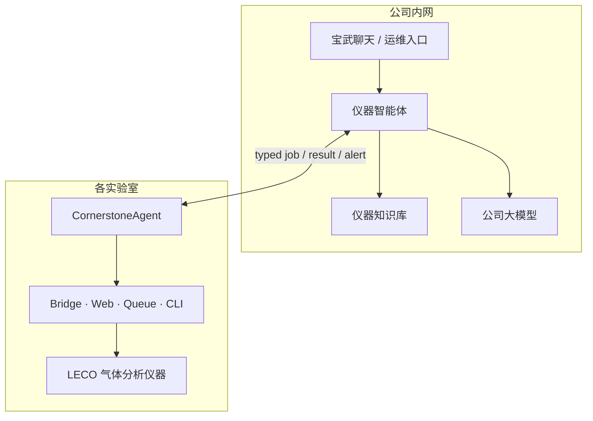
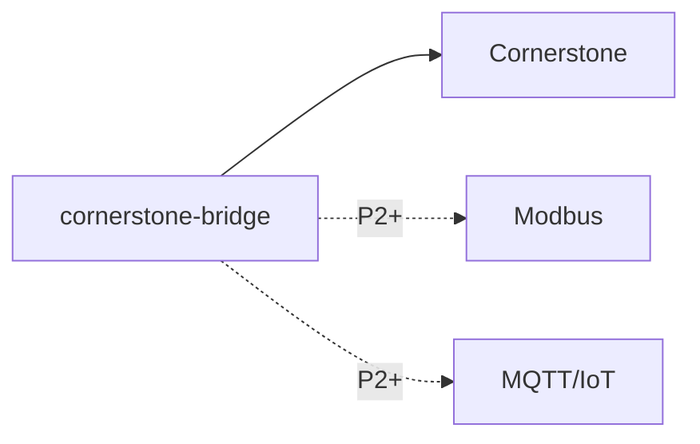
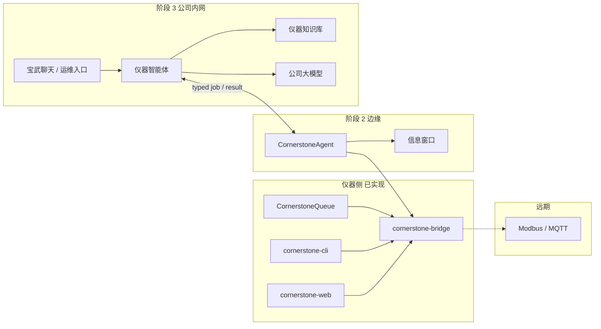
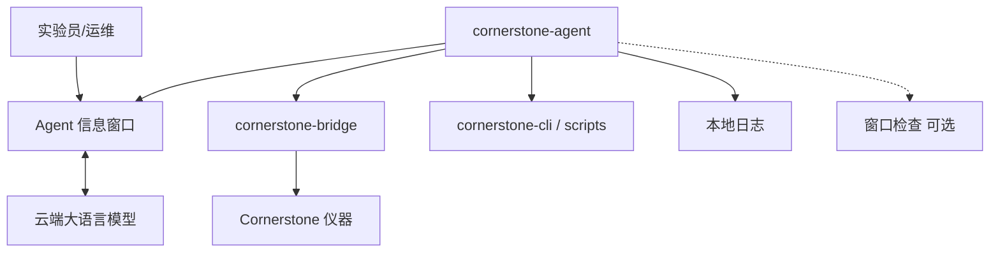
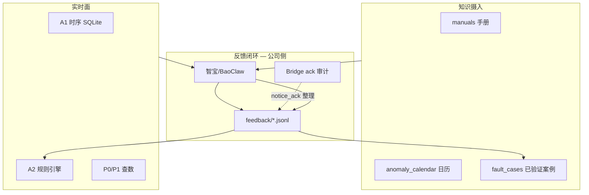

# Cornerstone 后续开发计划

围绕 LECO 气体分析仪器远程运维，构建「稳定通信 + AI 诊断 + 自动处置」能力。基于当前仓库（`cornerstone-cli` + `cornerstone-bridge` + `cornerstone-web` + `CornerstoneQueue` + `CornerstoneAgent`），分阶段落地。

> 与对外汇报对齐：[docs/Cornerstone项目汇报.md](docs/Cornerstone项目汇报.md)

### 进度快照（2026-08）


| 阶段 | 组件 | 状态 |
| --- | --- | --- |
| **0–1** | Bridge / Web / CLI：TCP 网关 + REST + XML 解析、配置拆分、Bridge 控制台、Web 分析页（ECharts） | ✅ 已实现 |
| **1b** | CornerstoneQueue：试样代码缓存、Bridge 在线管理与发送、贴边收纳 | ✅ 已实现 |
| **2** | 边缘 **CornerstoneAgent**：A0 编排 + P0/P1 查数；**A1 长周期 SQLite 时序**；**D0–D2 建议下行 → Bridge 操作员对话框** | ✅ A0–A1 + 下行已落地；A2 规则 / A3 信息窗口未做 |
| **3** | 公司内网：**仪器智能体**、**仪器知识库**、**公司大模型**；对话查询分析结果与仪器状态 | ✅ C0–C1（智宝 P0/P1）；C2 检索 / C2+ 反馈 schema 进行中；C3 宝武聊天未做 |
| **远期** | Bridge 北向 Modbus / MQTT | 📋 暂缓 |


**已确定架构**：仪器侧 **Bridge = 网关 + 协议解析 + REST**；`**cornerstone-web`** 仅静态 SPA + `/api/`* 反向代理；AI 能力经 **边缘 Agent + 公司内网智能体 + 知识库 + 大模型** 分层扩展（见下文「目标架构」）。Modbus/MQTT 北向保留在 Bridge 包内，待 OT/IT 对接需求明确后再排期。

### 当前目标（阶段 3）

- 学习了解公司大模型，争取打通实验室 ↔ 公司内网环境；
- 跑通基本业务：对话查询**分析结果数据**与**仪器状态**（经 Agent 采集 Bridge REST，智能体编排回复）。

### 后续计划（阶段 3 延续）

- 探索对话能力集成到 **宝武聊天**（或公司统一运维入口）；
- 建设**仪器知识库**：说明书、图纸、应用文档、维修经验等，供智能体检索增强；
- 并行推进边缘 Agent A0–A2（采集 + 规则），为智能体提供结构化上下文。

**已确定边界**：**Bridge = 网关 + 对内 REST**；北向 Modbus/MQTT 与 Agent/智能体解耦，不阻塞当前大模型对接。

---

## 架构决策（仓库边界）

### 已实现运行时架构（阶段 0–1 ✅）

```mermaid
flowchart TB
  subgraph clients [客户端]
    TCP[TCP 远程客户端]
    Browser[浏览器]
    Queue[CornerstoneQueue 悬浮窗]
  end
  subgraph web [cornerstone-web : web_port]
    SPA[web_static / index.html]
    PROXY[/api/* 反向代理]
  end
  subgraph bridge [cornerstone-bridge]
    GW[TCP 网关 gateway.py]
    HUB[GatewayHub hub.py]
    API[REST http_api.py]
    PARSE[parsers.py]
  end
  CS[Cornerstone 仪器]
  TCP --> GW
  Browser --> SPA
  Queue --> API
  SPA --> PROXY
  PROXY --> API
  GW --> HUB
  API --> HUB
  HUB --> CS
  PARSE --> HUB
```


| 监听（示例配置）                                              | 进程     | 说明                            |
| ----------------------------------------------------- | ------ | ----------------------------- |
| `host:port`（如 `0.0.0.0:54321`）                        | Bridge | C# / CLI 远程客户端连此 TCP 网关       |
| `bridge_api_host:bridge_api_port`（如 `127.0.0.1:8081`） | Bridge | 对内 REST；悬浮窗 / 脚本应连此地址         |
| `web_host:web_port`（如 `127.0.0.1:8080`）               | Web    | 浏览器访问；`/api/*` 代理到 Bridge API |


**Bridge 包内模块**（`CornerstoneBridge/src/cornerstone_bridge/`）：`protocol.py`、`parsers.py`、`hub.py`、`hub_helpers.py`、`hub_types.py`、`gateway.py`、`http_api.py`、`server.py`、`config.py`、`bridge_logging.py`；桌面控制台 `ui/`（`cornerstone-bridge-ui`）。

**Web 包**（`CornerstoneWeb/src/cornerstone_web/`）：`web_static/`（含 `echarts.min.js` 分析页谱图）、`http_server.py`（静态 + 代理）、`server.py`、`dev_web.py`（`cornerstone-web-dev` 同进程拉起 Bridge + Web，转发 Bridge 全部配置项含 `upstream_inner_reassembly_timeout`）。

### 目标架构（汇报版）


```mermaid
flowchart TB
  subgraph corp ["公司内网"]
    U["宝武聊天 / 运维入口"]
    O["仪器智能体"]
    K["仪器知识库"]
    M["公司大模型"]
    U --> O
    O --> M
    O --> K
  end

  subgraph lab ["各实验室"]
    A["CornerstoneAgent"]
    E["Bridge · Web · Queue · CLI"]
    I["LECO 气体分析仪器"]
    A --> E --> I
  end

  O <-->|"typed job / result / alert"| A
```

| 标签 | 说明 |
| --- | --- |
| 统一协议 | TCP/XML + Bridge REST |
| 分层部署 | 仪器侧 + 边缘 Agent（执行面）+ 公司内网智能体（对话大脑） |
| REST 能力 | Bridge REST；Web `/api` 反代 |
| AI 扩展 | Agent 执行采集/规则；BaoClaw 对话 + 知识库 + 大模型；边界见 [ENTERPRISE.md §0](CornerstoneAgent/ENTERPRISE.md) |

**远期北向扩展**（暂缓）：


```mermaid
flowchart LR
  Bridge[cornerstone-bridge] --> CS[Cornerstone]
  Bridge -.->|P2+| MB[Modbus]
  Bridge -.->|P2+| MQTT[MQTT/IoT]
```


| 组件                     | 职责                                                                                                                   |
| ---------------------- | -------------------------------------------------------------------------------------------------------------------- |
| **cornerstone-cli**    | 协议帧、TCP 引擎、可选 CLI；**共享库**，不单独跑网关                                                                                     |
| **cornerstone-bridge** | 上游 TCP 网关、AddSamples 队列、`instrument_rq`、**XML→JSON 解析**、对内 REST；上游 inner 帧跨 TCP 分段拼接（`upstream_inner_reassembly_timeout`）；TCP 客户端 `Logon`/`Logoff` 合成应答；**北向** Modbus/MQTT（Gateway + Protocol Adapters，可同进程） |
| **cornerstone-web**    | 静态资源 + 薄 BFF（或纯静态直连 Bridge API）；**不再** `import GatewayHub`                                                           |
| **cornerstone-queue**  | 桌面悬浮窗，仅 HTTP 客户端                                                                                                     |
| **cornerstone-agent**  | 仪器参数长/短期采集、规则建议、**云端 LLM 信息窗口**；经 Bridge REST / CLI 脚本 / 本地日志 / 窗口检查取数，不嵌套网关 |


**开发/仿真**：保留 `**cornerstone-web-dev` = Bridge + Web 一键启动**（与现有一键体验一致）。  
**生产**：可只部署 **Bridge**；Web 可为 Nginx 静态 + Bridge API。

### 实施顺序（不必一步拆光）


| 阶段       | 内容                                                                                                                                   |
| -------- | ------------------------------------------------------------------------------------------------------------------------------------ |
| **0** ✅  | 仓内逻辑分包：`cornerstone_bridge` 下 `protocol.py` / `parsers.py` / `http_api.py` / `hub.py` / `gateway.py`                                 |
| **1** ✅  | `cornerstone-bridge` / `cornerstone-web` 独立进程；配置拆为 `cornerstone-bridge.config.toml` + `cornerstone-web.config.toml`（兼容 `.json`）；`cornerstone-web-dev` 一键启动 |
| **1b** ✅ | `CornerstoneQueue` 悬浮窗 M1–M3 + 仪器 UI 自动点击（WinUI 3，HTTP 调 Bridge REST）                                                                  |
| **2**    | 边缘 `CornerstoneAgent` A0–A4：Bridge 采集、规则、信息窗口；只依赖 Bridge API，不碰 TCP Cookie                                                      |
| **3**    | 公司内网仪器智能体 + 知识库 + 大模型；对话查询仪器状态与分析数据；宝武聊天等入口集成                                                                      |
| **远期**   | Bridge 北向 Modbus/MQTT（映射与 `instrument_rq` 读数共用）                                                                                      |


### Bridge 第一版 REST（与现有 `/api/`* 对齐）

Bridge 至少提供：

- `GET/POST /api/queue`、`/api/status`、`/api/config`、`PUT /api/settings`  
- `GET /api/instrument/`*、`/api/settings/*`、`/api/diagnostic/*`、`/api/environment/*`  
- 可选：原始 **TCP 代理端口**（与现在 `host:port` 一致），供 C# 客户端继续连 Bridge

**解析器归属**：放 **Bridge**（Web 只渲染 JSON）；Bridge 仅透传 XML 会导致 Web/Agent/Queue 重复解析，**不推荐**。

---

## 总览（产品线）


| 序号  | 方向         | 定位                       | 与仓库关系                                                             |
| --- | ---------- | ------------------------ | ----------------------------------------------------------------- |
| 1   | 缓存样品悬浮窗    | 轻量桌面端，专注队列查看与「发送至仪器」     | `**CornerstoneQueue/`**（WinUI 3）；消费 Bridge `GET/POST /api/queue`* |
| 2   | 边缘 Agent + 公司智能体 | 采集 + 规则 + **对话式运维**（分析结果、仪器状态、排故） | [CornerstoneAgent/AGENT.md](CornerstoneAgent/AGENT.md)、[ENTERPRISE.md](CornerstoneAgent/ENTERPRISE.md)；边缘 Agent 只连本机 Bridge |
| 3   | 协议转换网关（远期） | 厂家私有协议 ↔ Modbus / 通用 IoT | **cornerstone-bridge** 北向扩展；**暂缓**，待 OT/IT 需求明确 |



```mermaid
flowchart LR
  subgraph core [仪器侧 已实现]
    CLI[cornerstone-cli]
    Bridge[cornerstone-bridge]
    Web[cornerstone-web]
    Float[CornerstoneQueue]
  end
  subgraph p2 [阶段 2 边缘]
    Agent[CornerstoneAgent]
    Win[信息窗口]
  end
  subgraph p3 [阶段 3 公司内网]
    Chat[宝武聊天 / 运维入口]
    Orch[仪器智能体]
    KB[仪器知识库]
    LLM[公司大模型]
  end
  subgraph future [远期]
    MB[Modbus / MQTT]
  end
  Float --> Bridge
  CLI --> Bridge
  Web --> Bridge
  Agent --> Bridge
  Agent --> Win
  Chat --> Orch
  Orch --> LLM
  Orch --> KB
  Orch <-->|"typed job / result"| Agent
  Bridge -.-> MB
```


目录命名与 PLAN 一致：`**CornerstoneQueue**`（勿用 `CornetstoneQueue`）、`**CornerstoneBridge**`、`**CornerstoneAgent**`。

---

## 1. 缓存样品指令悬浮窗（独立程序）

### 目标

- 常驻桌面、可置顶的小窗，**只负责** Bridge 截留的 `AddSamples` 队列：列表、勾选、发送至仪器、刷新。
- 不替代完整 Web 分析页，缩短操作路径（实验员多屏/全屏 Cornerstone 时仍能看到队列）。

### 数据来源


| API                    | 用途                                             |
| ---------------------- | ---------------------------------------------- |
| `GET /api/queue`       | 列表：`id`、`sampleName`、`sampleDescription`、时间、来源 |
| `POST /api/queue/send` | `{"ids":[...]}`，发送后**保留**队列（`queueKept: true`） |
| `GET /api/status`（可选）  | `businessOnline`、失败计数、队列、RemoteControl 状态                  |


配置：Bridge REST 基址 `**http://<bridge_api_host>:<bridge_api_port>`**（示例 `http://127.0.0.1:8081`）。勿与 Web 页端口 `web_port`（8080）混淆。

### 技术栈

- **WinUI 3**（Windows App SDK）：与现有 C# 客户端技能栈一致；目标平台 Windows 10 1809+ / Windows 11。
- 托盘图标 + 可拖拽悬浮窗；列顺序与 Web 对齐：**样品名称 → 样品说明**。

### 阶段划分


| 阶段         | 内容                                 | 验收               | 状态  |
| ---------- | ---------------------------------- | ---------------- | --- |
| **M1**     | 只读：轮询/手动刷新队列，展示连接状态                | 与 Web 队列数据一致     | ✅   |
| **M2**     | 多选 +「发送至仪器」+ 结果提示（成功/上游 XML 摘要）    | 行为与 Web「发送至仪器」一致 | ✅   |
| **M3**     | 设置页（Bridge URL、刷新间隔、窗口置顶/透明度）；断线重连 | 7×24 挂机可用        | ✅   |
| **仪器 UI 自动点击** | 发送成功后可选点击 Cornerstone 消息/添加试样（FlaUI；设置内 Inspect/测试） | 与 Web 发送行为一致时可减少手工确认 | ✅   |


### 已实现要点（`CornerstoneQueue/`）

- **技术**：WinUI 3（Windows App SDK 1.6）、`net8.0-windows10.0.19041.0`、x64；`WindowsAppSDKSelfContained` 便于未预装运行时的本机部署。
- **API**：`GET /api/queue`、`POST /api/queue/send`、`GET /api/status`、`GET /api/config`；默认 Bridge `http://127.0.0.1:8081`（设置可改）。
- **UI**：顶栏单行状态、列表每试样一行（`样品名 → 说明`）、底栏单行发送结果；队列指纹未变时不刷新列表（防闪烁）。
- **M3 设置**：`%LocalAppData%\CornerstoneQueue\settings.json` — Bridge 基址、状态/队列轮询秒数、置顶、透明度、字号与窗体缩放、断线重连间隔；仪器 UI 自动点击相关项见上。
- **增强（超出原 M3 文案）**：屏幕边缘拖放收纳（上侧滑出屏外，左右侧细条唤回）；禁用系统贴靠布局干扰（`SystemSnapDisabler`）。
- **仪器 UI 自动点击（✅）**：`InstrumentUiAutomationService`（FlaUI UIA3）；设置中开关「发送后自动点击仪器 UI」、窗口标题/AutomationId、步骤延时；**Inspect 检查控件** / **测试点击**（`InstrumentUiInspectWindow`）。默认关闭，因仪器版本与分辨率差异需现场校准。
- **明确不做**：Windows **系统通知**（发送失败、队列满 Toast）、**全局快捷键**唤起悬浮窗——已从路线图移除，不再开发。
- **构建**：`CornerstoneQueue.sln`，Visual Studio 2026/2022；说明见根目录 [README.md](README.md#cornerstonequeue缓存样品悬浮窗)。

### 风险与约束

- Bridge 未对 TCP 客户端做鉴权时，悬浮窗应仅连**内网**。
- 若未配置网页账号（`web_user` / `web_password`），发送会失败，需在 UI 明确提示（状态栏/发送结果已提示）。
- **仪器桌面确认**：协议 `ErrorCode=0` 后本机 UI 仍可能需确认；可在设置中启用 **自动点击仪器 UI**（脆弱，依赖 AutomationId/控件树）。仍建议优先查仪器 RSL 免确认；失败时查看发送结果栏中的「UI 点击」摘要。

---

## 2. 协议转换（Bridge：网关 + Modbus / IoT）— 远期暂缓

> **排期说明**：汇报路线图中 Modbus/MQTT 列为远期；当前资源优先投入阶段 2–3（Agent + 公司大模型对话）。本节保留技术方案，待 OT/IT 对接需求明确后重启。

### 目标

- **Bridge** 统一承担：
  - **南向**：Cornerstone 远程控制 XML/TCP（网关、会话、`instrument_rq`、XML→JSON）；
  - **北向**：Modbus 寄存器/线圈、MQTT/HTTP JSON（主题/点位可配置）。
- 不再与 Web 混在同一进程职责中；Web 仅展示与编排。

### 架构

```
[Cornerstone 仪器] ←TCP/XML→ [cornerstone-bridge] → Modbus Slave / MQTT Broker
                              ↑
                    [映射配置 YAML/JSON]
                    [cornerstone_cli 通信复用]
         [cornerstone-web] ──HTTP──→ Bridge REST
         [CornerstoneQueue] ──HTTP──→ Bridge REST
```

**核心模块（Bridge 内）**

1. **Gateway**（`gateway.py`）：多客户端 TCP、上游单连接、AddSamples 队列、Cookie 路由；`Logon`/`Logoff` 合成应答（网关已持上游会话时）。
2. **解析与对内 REST**（`parsers.py` + `http_api.py`）：`_parse_`* → JSON；队列、status、instrument/* 等 API。
3. **映射引擎**：配置驱动——JSON 字段 → Modbus 地址 / MQTT topic。
4. **北向出口**：Modbus TCP Server（如 pymodbus）；MQTT：`instrument/{id}/status`、`/queue/count`、`/alarm/...`。
5. **管理面**：健康检查、最后成功时间、映射热加载（可选）。

### 阶段划分


| 阶段       | 内容                                                   | 验收               |
| -------- | ---------------------------------------------------- | ---------------- |
| **P0** ✅ | 仓内模块化（`cornerstone_bridge` 分包）                       | 已完成              |
| **P1** ✅ | `cornerstone-bridge` 独立进程 + REST；Web 代理 `/api/`*     | 已完成              |
| **P2**   | 只读映射：`Status`、`RemoteControlState`、队列 `queueCurrent` | Modbus + MQTT 可读 |
| **P3**   | 扩展：`Ambients`、`Counters`；文档化寄存器表                     | 与仪器/Web 读数一致     |
| **P4**   | 写侧（谨慎）：白名单 RC / Modbus 触发刷新                          | 权限与互锁            |
| **P5**   | 第二厂家协议插件（`SouthboundAdapter`）                        | 插件接入             |


### 与 CLI / Web 的分工

- **开发期**：`cornerstone-web-dev` 一键起 Bridge + Web；无仪器时用 Bridge 联调。
- **生产期**：Bridge 贴仪器工控机；Web 可放办公网，仅调 Bridge REST。

### 交付物

- Python 包 `**cornerstone-bridge`**；
- 《Modbus 点表》+《MQTT 主题规范》+ 示例 Node-RED / ThingsBoard 接入。

---

## 3. 边缘 Agent 与公司智能体（参数采集 + 规则 + 对话式运维）

> **详细规格**：[CornerstoneAgent/AGENT.md](CornerstoneAgent/AGENT.md)（边缘）、[CornerstoneAgent/ENTERPRISE.md](CornerstoneAgent/ENTERPRISE.md)（公司内网）、[CornerstoneAgent/INTERFACE.md](CornerstoneAgent/INTERFACE.md)（BaoClaw tool ↔ Agent job）、[CornerstoneAgent/LOCAL-DEV.md](CornerstoneAgent/LOCAL-DEV.md)（本地 POC）

### 目标（重规划 2026-05）

部署在**仪器工控机或实验室边缘 PC** 上的常驻 **cornerstone-agent**，承担三类能力：

1. **参数采集（长周期 / 短期）**
   - **长周期**：按间隔记录 `Status`、`system-parameters`、`counters`、诊断检查等，写入本地时序库，用于漂移对比与维护周期提醒。
   - **短期**：分析批次或排故会话内加密采样 `set-stats` / `set-reps` / 状态字段，形成可回放「采集包」。
2. **规则建议（始终可用）**
   - 对分析数据（RSD、空白、n 不足等）与仪器状态（漏气、系统检查、业务离线、队列异常）输出结构化建议（通过 / 复核 / 维护 / 排故），**不依赖 LLM**。
3. **云端大语言模型协作**
   - **AI 能力通过云端 LLM 实现**：Agent 按 LLM 编排或用户追问，用 Bridge REST、`cornerstone-cli` 脚本、本地 `bridge.log` 尾随、可选 **UI 窗口检查**（FlaUI，与 Queue 同源能力）组装上下文，回传云端；**Agent 提供与大语言模型输出的信息窗口**（托盘/小窗），指导正确使用仪器、快速维护与排故。
   - LLM **不直连仪器**；禁止将模型输出自动映射为仪器写操作。

### 架构


```mermaid
flowchart TB
  User[实验员/运维]
  LLM[云端大语言模型]
  WIN[Agent 信息窗口]
  AG[cornerstone-agent]
  BR[cornerstone-bridge]
  CLI[cornerstone-cli / scripts]
  LOG[本地日志]
  INS[窗口检查 可选]
  CS[Cornerstone 仪器]
  User --> WIN
  WIN <--> LLM
  AG --> WIN
  AG --> BR
  AG --> CLI
  AG --> LOG
  AG -.-> INS
  BR --> CS
```

| 采集路径 | 用途 |
|----------|------|
| Bridge REST | 默认：`/api/status`、`/api/instrument/*`、`/api/diagnostic/*` |
| CLI 脚本 | `CornerstoneAgent/scripts/` + `cornerstone-cli tcp …`，批量与排故 |
| 本地日志 | `bridge.log` 等尾部片段，排故上下文 |
| 窗口检查 | Windows UIA3 控件树摘要（可选，校准方式同 Queue Inspect） |

持久化：SQLite 时序 + 审计表（规则建议、LLM 回合、采集包引用）。北向 MQTT/告警摘要可在 Bridge P2+ 转发，非 Agent 首版必需。

### 阶段划分

**边缘 Agent（实验室）**

| 阶段 | 内容 | 验收 |
|------|------|------|
| **A0** | 包骨架、Bridge 客户端、`collect once` | 单次采集 JSON 落盘 |
| **A1** | 长/短周期调度 + SQLite | ✅ 24h 参数可查/导出（运维台时序页 / CLI） |
| **A2** | 规则引擎 v1（分析 + 状态 + 队列） | 结构化建议 JSON，可静默 |
| **A3** | 信息窗口 v1；对接公司编排 API（非直连仪器） | 对话展示建议与采集证据 |
| **A4** | CLI 子命令、日志 tail、UI inspect；与 Queue 发送事件可选联动 | 排故会话端到端 |
| **A5** | 心跳、离线队列、installer 可选组件 | 7×24 驻场 |

**公司内网（阶段 3，当前聚焦）**

| 阶段 | 内容 | 验收 |
|------|------|------|
| **C0** | 了解公司大模型 API；打通实验室 ↔ 内网网络 | 内网可访问模型 endpoint |
| **C1** | 仪器智能体 POC：对话查询 `sets` / `status` / `set-reps` 等 | ✅ 基建+P0/P1 tools+智宝对话；真 Bridge 已接 lab-2lg |
| **C2** | 仪器知识库 v1（文档入库 + 检索） | 排故/操作问题可引用手册片段 |
| **C2+** | 知识库反馈闭环 + `fault_cases` + 参数预警联动 | 问答结案可沉淀案例；ack 可验证规则 |
| **C3** | 宝武聊天（或统一运维入口）集成 | 用户从聊天发起查询并收到回复 |

### C2+ 知识库反馈闭环与参数预警（2026-08 规划）

目标：大模型从「查手册」进化为气体设备**老法师**——结合实时参数、历史案例与现场反馈，指导排故、调参与方法开发。


```mermaid
flowchart TB
  subgraph ingest [知识摄入]
    M[manuals 手册]
    AC[anomaly_calendar 日历]
    FC[fault_cases 已验证案例]
  end
  subgraph live [实时面]
    A1[A1 时序 SQLite]
    A2[A2 规则引擎]
    P1[P0/P1 查数]
  end
  subgraph loop [反馈闭环 — 公司侧]
    Z[智宝/BaoClaw]
    FB["feedback/*.jsonl"]
    BR[Bridge ack 审计]
    Z --> FB
    BR -.->|notice_ack 整理| FB
  end
  ingest --> Z
  live --> Z
  Z --> FB
  FB --> FC
  FB --> A2
```

#### 能力等级

| 等级 | 依赖 | 典型问答 |
|------|------|----------|
| **L1 检索员** | C2 手册 + 日历 | 「氧枪流量偏低一般查哪里？」 |
| **L2 诊断员** | L1 + A1/A2 + P1 | 「GC8 硫拖尾，氧枪 0.3，下一步？」 |
| **L3 参谋** | L2 + verified `fault_cases` + 反馈权重 | 「按机械手卡死案例逐项排除」 |
| **L4 老法师** | L3 + sets 统计 + 手顺 | 「空白偏高，燃烧时间/氧流量怎么调？」 |

#### 反馈事件（`kb-feedback.v1`）

| `kind` | 入口 | 沉淀 |
|--------|------|------|
| `chat_rating` | 智宝「有用/需改进」 | 检索权重 |
| `case_closure` | 排故结案 | `fault_cases` 草稿 → 审核 |
| `notice_ack` | Bridge 运维建议确认 | 规则有效性 + 案例 |
| `correction` | AI 纠错 | 降权错误引用 / 修订规则 |
| `escalation` | 转人工 | 工单（可选） |

Schema：`CornerstoneAgent/schemas/kb-feedback.v1.json`；**存储 Plan A**：`BaoClaw/knowledge/feedback/` + `feedback_tool.py`；流程：`BaoClaw/knowledge/schemas/FEEDBACK.md`。

#### 参数预警三层

| 层 | 机制 | 输出 | 反馈 |
|----|------|------|------|
| **硬规则** | A2 `rules_eval`（如氧枪流量 &lt; 0.5 L/min） | `post_operator_notice` 弹窗 | `notice_ack` 验证 |
| **统计基线** | A1 滚动 P5–P95 / 同方法结果分布 | `watch` 级上下文 | `params_before_after` 校准 |
| **案例相似** | `fault_cases` + 日历模式匹配 | 带频次的历史建议 | `useful_refs` 调权 |

原则不变：**规则优先、LLM 为辅**；每条建议带 `snapshot_id` / `case_id` / `ruleId` / 手册章节。

#### C2+ 落地顺序

| 优先级 | 事项 | 验收 |
|--------|------|------|
| **P0** | Plan A：`feedback/*.jsonl` + `feedback_tool.py` + 示例 | ✅ 已实施 |
| **P0** | `fault-case.v1` + verified 示例 | 3+ 案例 |
| **P1** | 智宝对话 append 插件（调 `feedback_tool.py`） | 无需机房 HTTP |
| **P1** | ack → `notice_ack` 整理脚本（读 Agent 审计） | 半自动入库 |
| **P1** | C2 检索接入（案例 &gt; 日历 &gt; 手册） | 回答含 `case_id` |
| **P2** | A2 规则 v1（5–10 条高频）+ `rules_eval` tool | 预警 → 建议 → ack 闭环 |
| **P2** | `promote` 审核工作流 + MD 摘要生成 | 周审入库 |
| **P3** | L4 调参/方法引导（sets 统计） | 方法开发问答 |

### 设计原则

- **规则优先、LLM 为辅**；LLM 失败时仅展示规则结果。
- 输入：结构化字段 + 脱敏统计 + 日志/Inspect 摘要；样品标识可配置脱敏。
- 追溯：每条建议带 `ruleId` 或 `model` + `timestamp` + `snapshotId`。
- Agent 只读仪器（与现 Bridge/Queue 边界一致）；人工发样仍由 **CornerstoneQueue** / Web 完成。

### 与计划 1、2 的协同

- **Bridge REST** 为实验室与生产的统一数据面；Agent 不重复 XML 解析。
- **Web** 保留分析图表；Agent 窗口负责「下一步怎么做」话术与告警。
- **Queue** 发样成功后可选触发 Agent 短期采集；Inspect 逻辑可复用，不合并进程。
- **Bridge 北向**（Modbus/MQTT）可订阅 Agent 告警摘要，供 MES/大屏。

---

## 推荐实施顺序与资源粗估


| 优先级    | 项目                            | 理由                   | 粗估（1 人） |
| ------ | ----------------------------- | -------------------- | ------- |
| **已完成** | 仪器侧 0–1 + Queue 1b        | 远程控制底座与多入口已落地     | —       |
| **高**  | 阶段 3 C0–C1：大模型对接 + 对话查数 POC | 汇报当前目标；验证端到端价值     | 2–4 周   |
| **中高**    | 边缘 Agent A2 规则引擎 + C2 知识库 v1 | 为智能体提供研判与文档上下文      | 3–5 周   |
| **中高** | C2+ 反馈闭环 + `fault_cases` + 预警联动 | 老法师进化：问答→沉淀→规则      | 2–4 周   |
| **中**  | C3 宝武聊天集成、Agent A3 信息窗口 | 统一入口与现场小窗并存         | 2–4 周   |
| **暂缓** | Bridge P2–P4（Modbus/MQTT）   | OT/IT 对接非当前课题主线       | 待需求明确 |


### 建议里程碑

1. **已完成（2026 Q1–Q2）**：Bridge/Web/CLI 通信底座；Queue 试样缓存；Web 分析页 ECharts；安装包与 Bridge 控制台。
2. **已完成（2026 Q3）**：C0–C1 智宝对话查数；边缘 Agent A0 + **A1 长周期 SQLite 时序**。
3. **下一阶段**：Agent A2 规则引擎；仪器知识库 v1（C2）；**C2+ 反馈闭环与 `fault_cases`**；宝武聊天集成探索（C3）；A3 信息窗口（可与 Bridge 运维建议对话框并存）。
4. **远期**：Bridge Modbus/MQTT 北向；多厂家南向插件；生产硬化（鉴权、TLS、审计）。

> **2026-08 增量**：告警/建议下行路径 D0–D2 已落地——智宝/编排经 `post_operator_notice` → Agent → Bridge `/api/operator-notices` → 操作员对话框；ack 可经 `/api/ui/operator-notices/sync` 回写审计。  
> **2026-08 规划**：C2+ 反馈 **Plan A** 已实施——`BaoClaw/knowledge/feedback/*.jsonl` + `feedback_tool.py`；实验室编排不存反馈，仅回传 snapshot 证据。

---

## 仓库与文档建议


| 目录/包                                       | 说明                                                                                              |
| ------------------------------------------ | ----------------------------------------------------------------------------------------------- |
| `CornerstoneCLI` / `cornerstone-cli`       | 共享协议库                                                                                           |
| `CornerstoneBridge` / `cornerstone-bridge` | 网关 + 解析 + REST（`cornerstone-bridge`）；`cornerstone-bridge-ui` 桌面控制台；北向 Modbus/MQTT（远期暂缓） |
| `CornerstoneWeb` / `**cornerstone-web`**   | 静态 UI + 可选 BFF；`web_static` 含 ECharts；入口 `cornerstone-web`、`cornerstone-web-dev`                                       |
| `CornerstoneQueue`                         | WinUI 3 悬浮窗（M1–M3 + 可选 UI 自动点击 ✅）；`CornerstoneQueue.sln`；设置见 `%LocalAppData%\CornerstoneQueue\settings.json` |
| `installer/`                               | PyInstaller + Inno Setup：Bridge 必选，Web/Queue/CLI/Bridge 控制台可选；Bridge/Web 可注册系统服务（默认全选） |
| `CornerstoneAgent`                         | 边缘 Agent + 公司智能体规格；[AGENT.md](CornerstoneAgent/AGENT.md)、[ENTERPRISE.md](CornerstoneAgent/ENTERPRISE.md)、[INTERFACE.md](CornerstoneAgent/INTERFACE.md)、[LOCAL-DEV.md](CornerstoneAgent/LOCAL-DEV.md) |
| `docs/Cornerstone项目汇报.md`              | 对外汇报稿（与本文进度/后续计划对齐）                                                                   |


- 新程序建议**独立目录**（或后续独立仓库），pip 依赖 `cornerstone-cli` 或 HTTP 调用 Bridge。
- 根目录 `README.md` 链到本文件；集成说明随 Bridge/Web 拆分逐步更新。

---

## 待细化（按需展开）

- 安装包：服务账户权限、升级/覆盖安装策略、Python 运行时与 WinUI 依赖的离线体积优化
- 悬浮窗：仪器 UI 自动点击在不同 Cornerstone 版本上的控件树差异与校准文档
- Bridge：Modbus 寄存器表初稿、MQTT 主题命名规范；REST 与现 `/api/`* 差异清单
- Agent：[AGENT.md](CornerstoneAgent/AGENT.md) / [INTERFACE.md](CornerstoneAgent/INTERFACE.md) 已定义边界与 tool↔job 草案；待拆 `schemas/*.json`、默认 `rules/default.yaml`

