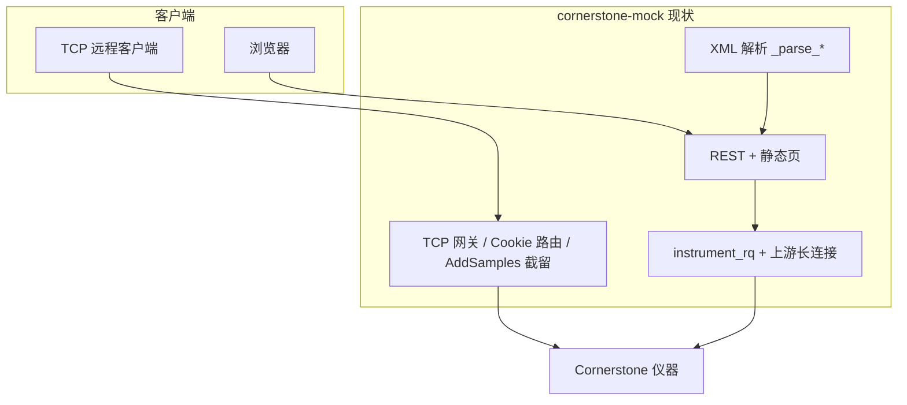
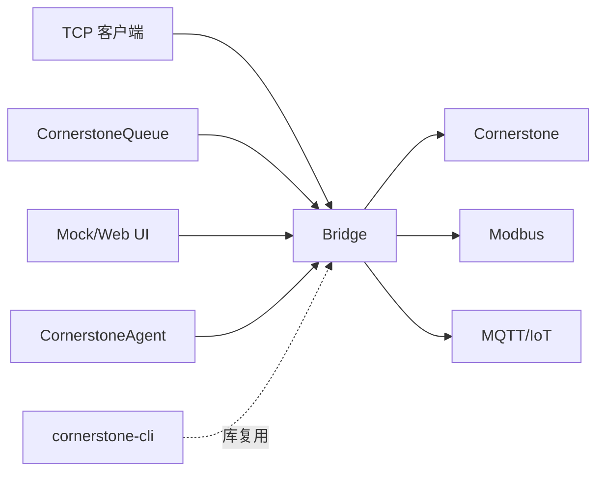

三个新目录目前还是空的，结合现有 `mock_server.py`（约 4500 行，网关 + 大量 `_parse_*` + HTTP/REST/静态页）和 `PLAN.md` 里的三条线，结论和建议如下。

---

## 结论（先给答案）

| 问题 | 建议 |
|------|------|
| **有没有必要拆 Mock？** | **长期有必要，短期不必一次性拆成多进程** |
| **Mock 只留网页、网关进 Bridge？** | **方向对，但要把「Bridge」职责写清楚**，避免和 PLAN 里「Modbus/IoT 协议转换」混成一个模糊大包 |
| **现在就要拆吗？** | **先在同仓内逻辑分包，再抽进程**；Queue 悬浮窗不必等拆分 |

另外：文件夹名建议把 `CornetstoneQueue` 改成 **`CornerstoneQueue`**（与 PLAN 一致）。

---

## 当前 Mock 实际干了三件事

1. **网关**：多客户端 TCP、上游单连接、Logon 补全/合成、`AddSamples` 队列、心跳/重连、退出 Logoff  
2. **协议解读**：Sets、SetReps、Ambients、方法/标样等 → JSON（专供网页）  
3. **Web**：`mock_web_static` + `/api/*`

三者耦合在 `GatewayHub` + `instrument_rq` 上：网页发 RQ 会走同一上游会话与锁。

---

## 和你规划的三个目录怎么对齐

| 目录 | PLAN 原意 | 若按「Mock=Web、Bridge=网关」拆分后 |
|------|-----------|-------------------------------------|
| **CornerstoneQueue** | 悬浮窗，消费队列 API | 只连 **Bridge（或 Mock）的 HTTP**：`GET/POST /api/queue*`，**不必**搬网关 |
| **CornerstoneBridge** | 厂家协议 → Modbus/IoT | 更适合做成：**南向** Cornerstone TCP/XML + **北向** Modbus/MQTT + **对内** REST（给 Web/Queue/Agent） |
| **CornerstoneAgent** | 本机审核/监控 | 连 **Bridge 对内 API** 或直接用 `cornerstone-cli` 库；不宜再嵌一套网关 |

若 **Bridge = 仅 Modbus**，而 **网关仍留在 Mock**，会出现：

- Queue / Agent / 悬浮窗仍依赖 Mock 进程  
- Modbus 侧又要自己连仪器或再依赖 Mock → **部署和会话模型更乱**

更干净的做法是：**Bridge 承担「连接仪器 + 会话」**，Mock/Web 变薄。

---

## 拆分的利弊

### 赞成拆（Mock ≈ Web，Bridge ≈ 网关 + 将来 Modbus）

1. **职责清晰**：Bridge = 基础设施；Web = 展示与编排；Queue/Agent = 其它客户端。  
2. **部署灵活**：Bridge 贴仪器工控机；Web 可放办公网（只调 Bridge REST）。  
3. **复用 PLAN**：Queue 不必 fork Mock；Agent 与 Modbus 共用同一「仪器侧真相源」。  
4. **测试**：网关单测、解析单测、UI 单测可分开。  

### 反对「现在就硬拆进程」

1. **`mock_server.py` 强耦合**：`fetch_*_json` → `hub.instrument_rq` → 同一 `_parse_*`；拆进程要先定 **Bridge 对外 API**（REST/gRPC），工作量不小。  
2. **开发体验**：本地要从「一个 `cornerstone-mock`」变成「Bridge + Web（+ 可选静态服务）」，调试链变长。  
3. **解析器放哪**：  
   - 放 Bridge：Web 只渲染 JSON → **合理**  
   - 放 Web：Bridge 只透传 XML → Web 变厚，Agent/Queue 也要重复解析 → **不推荐**  
4. **PLAN 里 Bridge 已指 Modbus/IoT**：若再加 TCP 网关，建议在文档里写成 **Bridge = Gateway + Protocol Adapters（两模块，可同进程）**。

---

## 推荐目标架构（与三个文件夹一致）

| 组件 | 职责 |
|------|------|
| **cornerstone-cli** | 协议帧、TCP 引擎、可选 CLI；**共享库**，不单独跑网关 |
| **cornerstone-bridge** | 上游 TCP 网关、AddSamples 队列、`instrument_rq`、**XML→JSON 解析**、对内 REST；**后续** Modbus/MQTT 北向 |
| **cornerstone-mock**（可改名 **cornerstone-web**） | 静态资源 + 薄 BFF（或纯静态直连 Bridge API） |
| **cornerstone-queue** | 桌面悬浮窗，仅 HTTP 客户端 |
| **cornerstone-agent** | 规则/AI、监控，调 Bridge API 或 `cornerstone_cli` |

**Mock 是否还要保留这个名字？**  
- 开发/仿真：可保留 **`cornerstone-mock-dev` = Bridge + Web 一键启动**（现在的体验不变）。  
- 生产：**只部署 Bridge**；Web 可以是 Nginx 静态 + Bridge API。

---

## 建议的实施顺序（不必一步拆光）

1. **阶段 0（现在）**  
   - 在 `CornerstoneMock` 内拆模块即可：`gateway.py` / `parsers.py` / `http_api.py` / `hub.py`，**仍单进程、单命令**。  
   - `CornerstoneQueue` 直接对接现有 `/api/queue*`，**不阻塞**拆分。

2. **阶段 1**  
   - 抽出 **`cornerstone-bridge`** 包：进程入口 `cornerstone-bridge`，暴露稳定 REST（队列、status、instrument/*）。  
   - Web 改为调 `http://bridge:port/api/...`（或同机 localhost）。

3. **阶段 2**  
   - **CornerstoneBridge** 增加 Modbus/MQTT（PLAN 第 2 条），映射表与 Bridge 内 `instrument_rq` 读数共用。

4. **阶段 3**  
   - **CornerstoneAgent** 只依赖 Bridge API + 可选 AI；不再碰 TCP Cookie。

这样 **「有必要拆」** 成立，但 **「Mock 只留网页」** 是阶段 1 的终点，不是第一天就要完成的重构。

---

## 若坚持「Mock 只负责网页」时的最小 API 边界

Bridge 至少提供（与现有 REST 对齐即可）：

- `GET/POST /api/queue`、`/api/status`、`/api/config`、`PUT /api/settings`  
- `GET /api/instrument/*`、`/api/settings/*`、`/api/diagnostic/*`、`/api/environment/*`  
- 可选：原始 **TCP 代理端口**（与现在 `host:port` 一致），供 C# 客户端继续连 Bridge  

Mock/Web **不再** `import GatewayHub`，只发 HTTP。

---

## 简要对照：拆 vs 不拆

| 维度 | 维持现状（单 Mock） | Mock=Web + Bridge=网关 |
|------|---------------------|-------------------------|
| 本地开发 | 最简单 | 需起 1～2 个服务（可用 dev 脚本合并） |
| Queue/Agent | 依赖 Mock 全量 | 只依赖 Bridge API，更干净 |
| Modbus/IoT | 易和 Mock 缠在一起 | 自然落在 Bridge |
| 重构成本 | 无 | 中（先模块化再拆进程） |
| 与 PLAN 一致性 | 弱 | 强 |

---

**总结**：  
- **有必要**把「网关 + 透传 + 仪器会话 + XML 解析」从「网页」里拆出去，放进 **CornerstoneBridge**，与 PLAN 的 Modbus/IoT、Agent、Queue 一致。  
- **Mock** 更适合演进为 **Web 壳（+ 可选薄 BFF）**，而不是继续扛 4500 行网关逻辑。  
- **不必立刻拆进程**：先模块分包 + Queue 用现有 API；Bridge 独立包和 REST 稳定后再让 Web 只调 Bridge。

若你确定采用「Bridge = 网关 + Modbus」这一条线，下一步可以在 `PLAN.md` 里补一节「仓库边界」，并列出 Bridge 第一版 REST 清单（与现有 `/api/*` 一一对应），便于按接口切文件。需要的话我可以直接改 `PLAN.md` 草稿（你确认后再提交）。