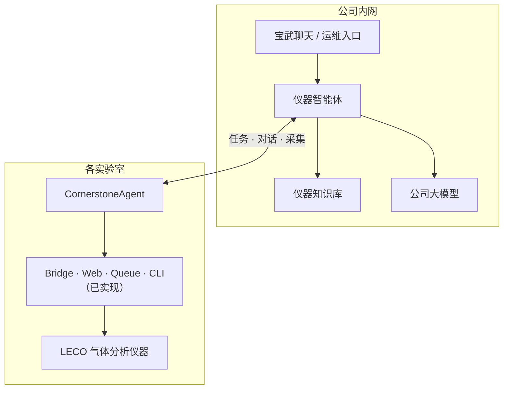
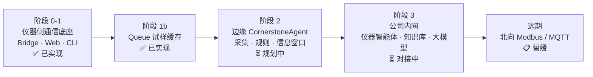
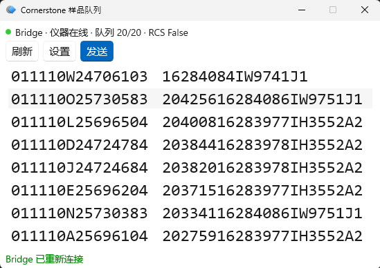
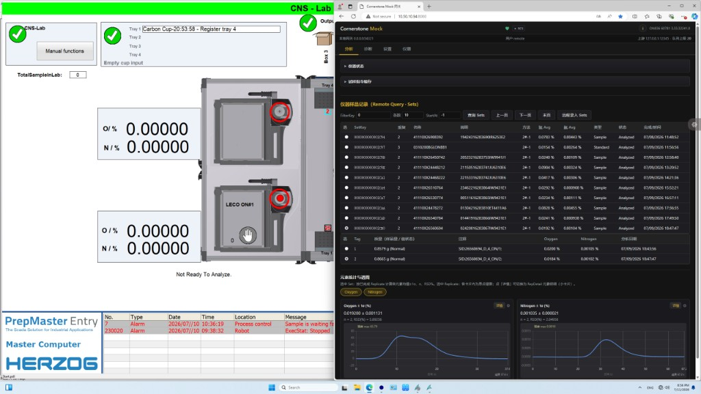

# LECO气体分析仪器AI赋能远程运维系统 — 项目汇报

> 源文件：`Cornerstone项目汇报简版.pptx`（原版）  
> 备份：`Cornerstone项目汇报简版.bak.pptx`

---

## 第 1 页：课题背景、目标与技术实现

**页眉**：Cornerstone Remote Control

**主标题**：课题背景、目标与技术实现

**副标题**：围绕 LECO 气体分析仪器远程运维场景，构建「稳定通信 + AI 诊断 + 自动处置」的智能化能力

---

### 一、课题背景

- LECO 气体分析仪器广泛应用于工业检测场景，传统运维依赖人工现场或远程手动操作。
- 现有模式存在效率低、响应慢、故障预判能力弱等问题。
- 在已具备基础远程控制能力的基础上，亟需引入 AI 提升主动运维、智能诊断与高效管控水平。

---

### 二、课题目标

1. **数据通信能力**：稳定运行 TCP/HTTP 远程通信、指令下发、样品登录、状态查询、网关转发与 Web 管理界面。
2. **AI 能力落地**：基于仪器状态、日志、环境数据，实现异常智能检测、故障自动预警、运行趋势预测。
3. **效率提升**：形成「远程控制 + 智能分析 + 自动处置」一体化运维能力。

---

### 技术实现支撑

仪器侧（Bridge / Web / Queue / CLI → 仪器）**已基本实现**；扩展为各实验室部署 **CornerstoneAgent**，公司内网部署**仪器智能体**与**知识库**，支撑对话查询与运维知识检索。

#### 技术架构图

**标签**：

| 标签 | 说明 |
|------|------|
| 统一协议 | TCP/XML + Bridge REST |
| 分层部署 | 仪器侧 + 边缘 Agent + 公司内网 |
| REST 能力 | Bridge REST；Web `/api` 反代 |
| AI 扩展 | Agent + 仪器智能体 + 知识库 + 大模型 |

**小结**：仪器侧通信底座已基本实现；边缘 Agent 负责采集与规则；公司内网智能体与知识库提供对话查询与知识增强。

---

## 第 2 页：项目进展及效果

**页眉**：Cornerstone Remote Control

**主标题**：项目进展及效果

**副标题**：远程控制底座与多入口已落地，当前聚焦大模型对接与对话式查询

---

### 进展流程图

---

### 已完成展示（图片位）

| 图 1 | 图 2 |
|------|------|
|  |  |
| Queue 悬浮窗 · 试样代码缓存 | Web 分析页 · 数据与状态查询 |

> PPT 排版：流程图下方左右各一图，宽约 45%，Caption 见上表。

---

### 已完成 · 基础能力

- Bridge / Web 分包与配置拆分，TCP 网关 + REST + XML 解析；
- Bridge 控制台、Web 分析页（ECharts 谱图与数据查询）；
- Queue 悬浮窗：试样代码手动缓存、Bridge 在线管理与发送；
- 仪器锁定自动状态下，Web 可查询分析结果与仪器状态。

---

### 当前目标

- 学习了解公司大模型，争取打通网络环境；
- 跑通基本业务逻辑：对话查询分析结果数据与仪器状态。

---

### 后续计划

- 探索对话功能集成到宝武聊天；
- 仪器知识库建立：说明书、图纸、应用文档、维修经验等。

---

## 编辑说明

| 字段             | 位置                                       |
| -------------- | ---------------------------------------- |
| 页眉 / 主标题 / 副标题 | 每页顶部                                     |
| 第 1 页架构图 | 见「技术架构图」Mermaid |
| 第 2 页 | 进展流程图 + 两张已完成截图（`queue.png` / `web.png`）+ 已完成 / 当前目标 / 后续计划 |
| 要点与编号列表        | 各 `###` 小节下 `-` 或 `1.` 条目                |

**与仓库文档同步**：修改进度或后续计划时，请同步更新 [PLAN.md](../PLAN.md)；Agent 技术细节见 [CornerstoneAgent/](../CornerstoneAgent/)。

修改本文档后，运行 `tools/update_report_ppt.py` 可从 MD 重新生成 PPT。